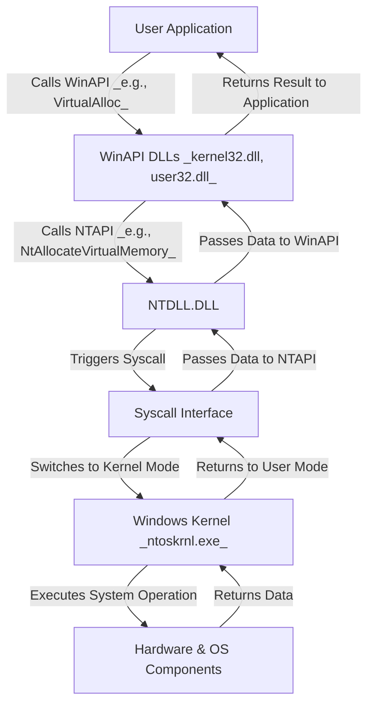
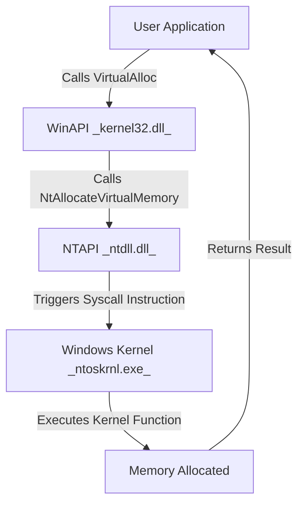

[Attack Computer/Attack Windows/1. Windows Basic/3. Flow of System Calls - ntdll.dll, kernel32.dll](<3. Flow of System Calls - ntdll.dll, kernel32.dll.md>)

https://j00ru.vexillium.org/syscalls/nt/64/


https://malwaretech.com/2023/12/an-introduction-to-bypassing-user-mode-edr-hooks.html


### **What is a Syscall (System Call)?**
A **syscall (system call)** is a **low-level function** that allows a **user-mode application** to **request services from the Windows Kernel (`ntoskrnl.exe`)**. It is the **bridge between user mode and kernel mode**, enabling programs to interact with the **hardware and OS resources**.

Syscalls are the **core mechanism** used when a **WinAPI function** (e.g., `VirtualAlloc`, `CreateFile`) needs to perform an **operating system-level action**.

==Syscalls exist in the Windows Kernel==, not in ntdll.dll.
ntdll.dll only provides the user-mode interface for calling syscalls.




---

### **Explanation of Flow**
1. **User Application Calls WinAPI**  
   - The program calls a standard function (e.g., `VirtualAlloc`) from `kernel32.dll` or `user32.dll`.
2. **WinAPI Calls NTAPI (ntdll.dll)**  
   - The **WinAPI function** internally calls an **NTAPI function** (e.g., `NtAllocateVirtualMemory`).
1. **NTAPI Calls a Syscall**  
   - `ntdll.dll` executes the **syscall instruction**, transferring execution to the **Windows Kernel**.
1. The **syscall interface** switches from **user mode** to **kernel mode** (`ring 3 → ring 0`)
2. The **Windows Kernel (`ntoskrnl.exe`)** processes the request and interacts with **hardware or system components**. The kernel handles the request using **SSDT (System Service Dispatch Table)**.
3. **Result is Returned**  
   - The kernel completes the task and returns the result through the **syscall interface** back to `ntdll.dll`.
   - Finally, the result is **returned to the application**.

---

## **3. Example of a Syscall in Action**
### **Example Syscall Mapping**
| **WinAPI Function**  | **NTAPI Function** (ntdll.dll) | **Syscall (SSDT)**        |
| -------------------- | ------------------------------ | ------------------------- |
| `VirtualAlloc`       | `NtAllocateVirtualMemory`      | `NtAllocateVirtualMemory` |
| `ReadFile`           | `NtReadFile`                   | `NtReadFile`              |
| `CreateProcess`      | `NtCreateProcess`              | `NtCreateProcess`         |
| `OpenProcess`        | `NtOpenProcess`                | `NtOpenProcess`           |
| `WriteProcessMemory` | `NtWriteVirtualMemory`         | `NtWriteVirtualMemory`    |

- The **NTAPI functions** in `ntdll.dll` (e.g., `NtAllocateVirtualMemory`) directly **call the corresponding syscall**.
- The **syscall itself (executed in kernel mode)** often has the **same name** as the NTAPI function.
==- The reason they have the same name is because `ntdll.dll` is simply a **user-mode wrapper** for invoking syscalls.==

✅ **Example: `NtAllocateVirtualMemory` (NTAPI) → `NtAllocateVirtualMemory` (Syscall in Kernel Mode)**  
✅ **Example: `NtCreateProcess` (NTAPI) → `NtCreateProcess` (Syscall in Kernel Mode)**  



---

## **2. Why Do NTAPI and Syscalls Have the Same Name?**
| **Layer**        | **Function**                         | **Purpose** |
|-----------------|---------------------------------|------------|
| **WinAPI**      | `VirtualAlloc`                 | High-level API for memory allocation. |
| **NTAPI**       | `NtAllocateVirtualMemory`      | Low-level API in `ntdll.dll` that wraps a syscall. |
| **Syscall**     | `NtAllocateVirtualMemory`      | Direct kernel function executed in `ntoskrnl.exe`. |

🔹 **`NtAllocateVirtualMemory` exists both in `ntdll.dll` (user mode) and `ntoskrnl.exe` (kernel mode).**  
🔹 The user-mode version in `ntdll.dll` **invokes the syscall instruction**, which transitions execution to **kernel mode**.  
🔹 The kernel-mode version inside `ntoskrnl.exe` **actually performs the operation**.

---

## **3. NTAPI vs. Syscall – Key Differences**
| **Aspect**       | **NTAPI (ntdll.dll)**         | **Syscall (Kernel Mode)**   |
|----------------|-------------------------|-------------------------|
| **Location**  | User mode (`ntdll.dll`)  | Kernel mode (`ntoskrnl.exe`) |
| **Execution Mode** | Runs in **Ring 3** | Runs in **Ring 0** |
| **How It Works** | Calls a syscall instruction (`syscall`, `sysenter`) | Executes the requested system operation |
| **Security Hooks?** | Can be hooked by AV/EDR | Harder to hook directly |
| **Performance** | Slightly slower (has to transition to kernel mode) | Direct execution in kernel mode |

---

## **4. How to Manually Call a Syscall directly(Without WinAPI)**

More info here: [Attack Computer/Attack Windows/3. EDR Evasion/2. Direct syscalls intro](<../1a. Windows Defense Mechanism/2. EDR Evasion/2. Direct syscalls intro.md>)
### **Example: Calling a Syscall in Assembly**
```assembly
section .text
global _start

_start:
    mov eax, 0x18  ; Syscall number for NtAllocateVirtualMemory
    mov edx, 0x1234  ; Some parameters
    int 0x2E        ; Trigger syscall (Windows XP and older)
```
⚠️ Modern Windows versions **no longer use `int 0x2E`** but instead use `syscall` or `sysenter`.


### For x64

```x64
section .text
global _start

_start:
    mov r10, rcx               ; Syscall convention requires RCX → R10
    mov eax, 0x18              ; Syscall number for NtAllocateVirtualMemory (example, may change)
    syscall                    ; Call the Windows Kernel
    ret                        ; Return to caller

```


---

