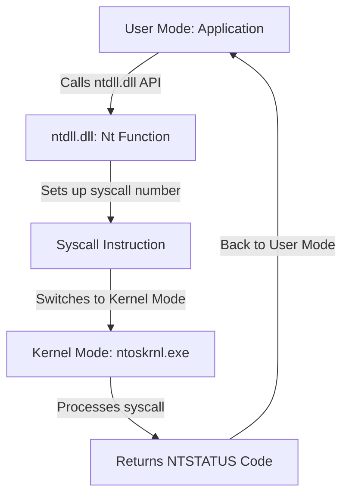
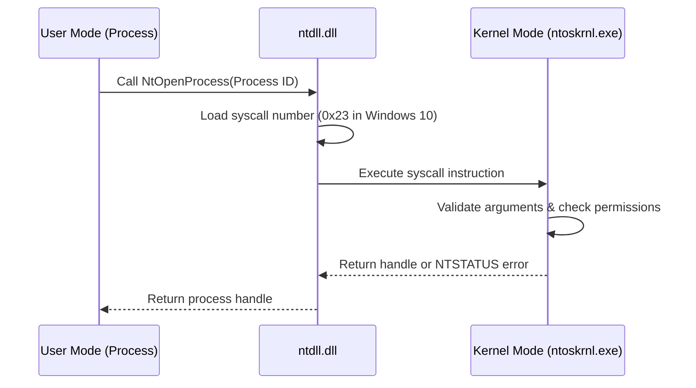

### **Windows Syscall Flow: Input & Output**  

In **Windows**, syscalls are handled through the **Native API (ntdll.dll)** and then passed to the **Windows Kernel (ntoskrnl.exe)**. The system call interface works differently from Linux, as Windows uses **NTSTATUS codes** for returns.


https://xacone.github.io/mitigate-indirect-syscalls.html


---

## **1. Windows Syscall Input & Output Flow**
### **1.1 Syscall Execution Flow**



- **Inputs to Syscall**:
  - **RCX, RDX, R8, R9, Stack** → First 4 arguments in registers, rest on stack.
  - **Syscall Number** in `EAX` → Specifies the function (e.g., `0x3C` for `NtOpenProcess`).
  - **User-Supplied Arguments** → Like process ID, file path, memory addresses.

*Awesome descriptions regarding registers --> https://hackmd.io/@paolieri/x86_64 

- **Outputs from Syscall**:
  - **RAX** → Holds the return value (NTSTATUS or pointer).
  - **Modified Registers & Memory** → If the syscall alters a buffer (e.g., `NtReadFile` fills a buffer).
  - **Handles / Descriptors** → For processes, files, etc.

---

## **2. Windows Syscall Example: `NtOpenProcess`**
**Opening a process (e.g., for injection or debugging)**:
- **Input:** Process ID
- **Output:** Handle to the process (or error)

```cpp
#include <windows.h>
#include <iostream>

extern "C" NTSTATUS NtOpenProcess(
    PHANDLE ProcessHandle, 
    ACCESS_MASK DesiredAccess, 
    POBJECT_ATTRIBUTES ObjectAttributes, 
    PCLIENT_ID ClientId
);

int main() {
    HANDLE hProcess;
    CLIENT_ID clientId = { (HANDLE)1234, 0 }; // Process ID 1234
    OBJECT_ATTRIBUTES objAttr = { sizeof(OBJECT_ATTRIBUTES) };

    NTSTATUS status = NtOpenProcess(&hProcess, PROCESS_ALL_ACCESS, &objAttr, &clientId);
    
    if (status == 0) {
        std::cout << "NtOpenProcess succeeded! Handle: " << hProcess << std::endl;
    } else {
        std::cout << "NtOpenProcess failed with NTSTATUS: " << std::hex << status << std::endl;
    }

    return 0;
}
```
- **Syscall Number:** `NtOpenProcess` (Varies by Windows version)
- **Inputs:** 
  - `ProcessHandle` (pointer to store result)
  - `DesiredAccess` (permissions requested)
  - `ObjectAttributes` (attributes like security)
  - `ClientId` (contains `ProcessId`)
- **Output:** 
  - **Handle to Process** (success)
  - **Error NTSTATUS code** (failure)
-
All syscalls reutrn NTSTATUS
* https://learn.microsoft.com/en-us/openspecs/windows_protocols/ms-erref/596a1078-e883-4972-9bbc-49e60bebca55
* https://doxygen.reactos.org/dir_a7ad942ac829d916497d820c4a26c555.html
* http://undocumented.ntinternals.net/

---

## **3. Windows Syscall Structure**
### **3.1 Calling Convention (x64)**
| Register | Purpose              |
| -------- | -------------------- |
| `RCX`    | First argument       |
| `RDX`    | Second argument      |
| `R8`     | Third argument       |
| `R9`     | Fourth argument      |
| Stack    | Additional arguments |
| `EAX`    | Syscall number       |
| `RAX`    | Return value         |

### **3.2 Syscall Number Lookup**
- Windows doesn’t expose syscall numbers **directly** like Linux.
	- Every syscall has a `System Service Number`
- We can **extract them dynamically** using `WinDbg` or **hardcode them for a specific version**.

Example to extract `NtOpenProcess` syscall number:
```powershell
$ntdll = [System.Runtime.InteropServices.Marshal]::GetModuleHandle("ntdll.dll")
$addr = [System.Runtime.InteropServices.Marshal]::GetProcAddress($ntdll, "NtOpenProcess")
Write-Output ("NtOpenProcess syscall address: " + $addr.ToString("X"))
```

---

## **4. Syscall Flow with Example**


---

## **5. Windows Syscall Return Values**
Windows syscalls return **NTSTATUS codes**, which differ from standard `errno` values in Linux.

| NTSTATUS Code | Meaning                    |
| ------------- | -------------------------- |
| `0x00000000`  | `STATUS_SUCCESS` (Success) |
| `0xC0000022`  | `STATUS_ACCESS_DENIED`     |
| `0xC0000008`  | `STATUS_INVALID_HANDLE`    |
| `0xC0000005`  | `STATUS_ACCESS_VIOLATION`  |

**Example: Checking return values**
```cpp
if (status == 0xC0000022) {
    std::cout << "Access Denied!" << std::endl;
}
```

---

