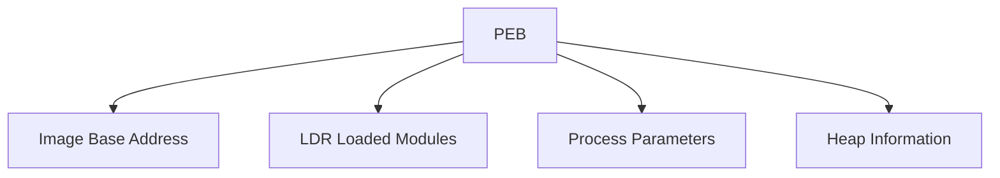
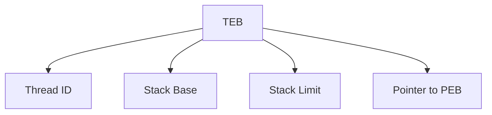
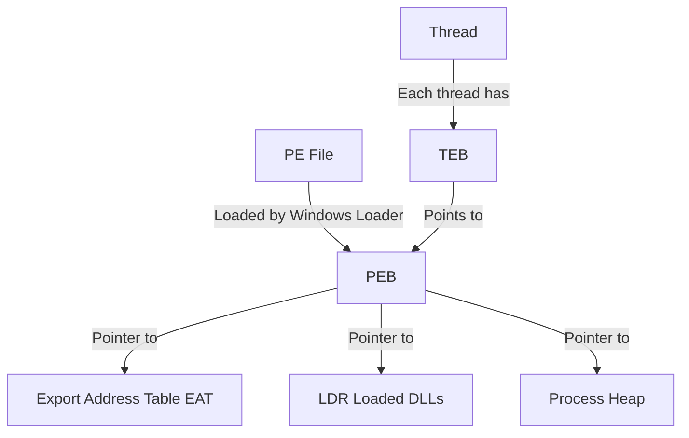

Resources: 

https://github.com/Faran-17/Windows-Internals/blob/main/Processes%20and%20Jobs/Processes/PEB%20-%20Part%201.md

https://github.com/Faran-17/Windows-Internals/blob/main/Processes%20and%20Jobs/Processes/PEB%20-%20Part%201.md

https://bowtiedcrawfish.substack.com/p/understanding-the-peb-and-teb

https://www.travismathison.com/posts/PEB_TEB_TIB-Structure-Offsets/

https://metehan-bulut.medium.com/understanding-the-process-environment-block-peb-for-malware-analysis-26315453793f


## **1. TEB and PEB - Where Are They Located?**
The **Thread Environment Block (TEB)** and **Process Environment Block (PEB)** exist in memory, not inside the PE file itself.

### **1.1 PEB - Process Environment Block**
- **Located in user-mode memory at `fs:0x30` (x86) or `gs:0x60` (x64)**
- **Holds information about the process**, such as:
  - ImageBaseAddress (where PE is loaded)
  - Loaded DLLs list
  - Process heap
  - Flags and debugging information



### **1.2 TEB - Thread Environment Block**
- **Located at `fs:0x18` (x86) or `gs:0x30` (x64)**
- **Holds per-thread data**, including:
  - Exception handling information
  - Stack limits
  - Thread ID
  - Pointer to PEB (to access process-wide information)



---

## **2. Relationship Between PE, PEB, and TEB**
- **PE is the file on disk.**
- **PEB is the process-wide data structure in memory.**
- **TEB is per-thread and contains a pointer to PEB.**
- **EAT is part of the PE file and is used to locate exported functions.**




### Why matter?
Thread Environment Block (TEB) contains a pointer to PEB. PEB stores the base address of ntdll.dll. By access PEB, ntdll.dll dynamic memory address, System Service Number (SSN) can be located. 


TEB has a pointer to PEB, but PEB does not contain the TEB

Example: 
Run notepad. 
`> WinDbgx.exe -pn notepad.exe`
From Windbg,  type `!teb` and location PEB Address
```
TEB at 00000076ce2ed000
    ExceptionList:        0000000000000000
    StackBase:            00000076cfe00000
    StackLimit:           00000076cfdfc000
    SubSystemTib:         0000000000000000
    FiberData:            0000000000001e00
    ArbitraryUserPointer: 0000000000000000
    Self:                 00000076ce2ed000
    EnvironmentPointer:   0000000000000000
    ClientId:             0000000000004148 . 00000000000036e8
    RpcHandle:            0000000000000000
    Tls Storage:          0000000000000000
    PEB Address:          00000076ce2b6000
    LastErrorValue:       0
    LastStatusValue:      0
    Count Owned Locks:    0
    HardErrorMode:        0
```

From Windbg, type `!peb`, we can see that ntdll.dll is dynamically located at `7ffd83120000`

```
0:026> !peb
PEB at 00000076ce2b6000
    InheritedAddressSpace:    No
    ReadImageFileExecOptions: No
    BeingDebugged:            Yes
    ImageBaseAddress:         00007ff6ee2f0000
    NtGlobalFlag:             0
    NtGlobalFlag2:            0
    Ldr                       00007ffd832f08a0
    Ldr.Initialized:          Yes
    Ldr.InInitializationOrderModuleList: 00000194fe1059b0 . 00000194887280b0
    Ldr.InLoadOrderModuleList:           00000194fe105b40 . 0000019488728090
    Ldr.InMemoryOrderModuleList:         00000194fe105b50 . 00000194887280a0
                       Base TimeStamp                     Module
            7ff6ee2f0000 67ab5982 Feb 11 09:06:58 2025 C:\Program Files\WindowsApps\Microsoft.WindowsNotepad_11.2412.16.0_x64__8wekyb3d8bbwe\Notepad\Notepad.exe
            7ffd83120000 facafff0 May 02 23:56:32 2103 C:\WINDOWS\SYSTEM32\ntdll.dll
```
### **What is the PEB (Process Environment Block)?**

The **Process Environment Block (PEB)** is a **user-mode structure** in Windows that stores information about the currently running process. It contains **process-level metadata** that helps manage execution, including module lists, process parameters, heap information, and OS version details.

It is a data structure stored in process memory and exists in every running process

---

## **3. Where is the PEB Located?**
- In **x86 (32-bit)** Windows, the PEB is located at:  
  ```assembly
  fs:[0x30]  ; In the TEB (Thread Environment Block)
  ```
- In **x64 (64-bit)** Windows, the PEB is located at:  
  ```assembly
  gs:[0x60]  ; In the TEB (Thread Environment Block)
  ```
- The **PEB address can be retrieved** using the `NtQueryInformationProcess` API or accessed directly via inline assembly.

---

## **4. Key Fields in the PEB**
| Field Name            | Description                                                                                                  |
| --------------------- | ------------------------------------------------------------------------------------------------------------ |
| **OSMajorVersion**    | Major OS version (e.g., `10` for Windows 10, `6` for Windows 7).                                             |
| **OSMinorVersion**    | Minor OS version (e.g., `1` for Windows 7, `0` for Windows 10).                                              |
| **OSBuildNumber**     | Windows build number (e.g., `19044` for Windows 10 21H2).                                                    |
| **BeingDebugged**     | Set to `1` if the process is being debugged. Used for anti-debugging techniques.                             |
| **Ldr**               | Pointer to `PEB_LDR_DATA`, which contains the loaded module list (DLLs).                                     |
| **ProcessParameters** | Pointer to **RTL_USER_PROCESS_PARAMETERS**, which stores command-line arguments, environment variables, etc. |

---

## 5. Example: Reading OS Version from the PEB (C++)**
This example retrieves the **OS major, minor, and build numbers** from the PEB.

```cpp
#include <windows.h>
#include <iostream>

typedef struct _PEB {
    BYTE Reserved1[4];
    BYTE BeingDebugged;
    BYTE Reserved2[23];
    PVOID Ldr;
    PVOID ProcessParameters;
    BYTE Reserved3[112];
    ULONG OSMajorVersion;
    ULONG OSMinorVersion;
    ULONG OSBuildNumber;
} PEB, *PPEB;

int main() {
    PPEB peb = (PPEB)__readgsqword(0x60); // Get PEB address in x64

    std::cout << "OS Major Version: " << peb->OSMajorVersion << std::endl;
    std::cout << "OS Minor Version: " << peb->OSMinorVersion << std::endl;
    std::cout << "OS Build Number: " << peb->OSBuildNumber << std::endl;

    return 0;
}
```
### **How It Works**
1. **Accesses the PEB structure** using `__readgsqword(0x60)`, which retrieves the **PEB address** from `GS:[0x60]` in x64.
2. Reads **OS version details** (`OSMajorVersion`, `OSMinorVersion`, `OSBuildNumber`).
3. Prints the **Windows version information**.

---

## **6. Anti-Debugging with PEB**
Many malware and security tools check **PEB->BeingDebugged** to detect debuggers.

### **Example: Checking If Being Debugged**
```cpp
#include <windows.h>
#include <iostream>

bool IsDebuggerPresentPEB() {
    return *(BYTE*)(__readgsqword(0x60) + 2); // BeingDebugged is at offset 0x02 in PEB
}

int main() {
    if (IsDebuggerPresentPEB()) {
        std::cout << "Debugger detected!" << std::endl;
    } else {
        std::cout << "No debugger detected." << std::endl;
    }
    return 0;
}
```

---

## **7. How to View PEB in WinDbg**
You can inspect the PEB structure using **WinDbg** or **x64dbg**.

### **Using WinDbg**
1. Attach to a process:
   ```
   windbg -pn target.exe
   ```
2. Display the PEB:
   ```
   !peb
   ```
   This will show details like the **OS version, loaded DLLs, and process parameters**.

### **Using x64dbg**
1. Attach to a process.
2. Open the **memory viewer**.
3. Navigate to:
   - **x86**: `fs:[0x30]`
   - **x64**: `gs:[0x60]`
4. Inspect the PEB fields manually.

---
