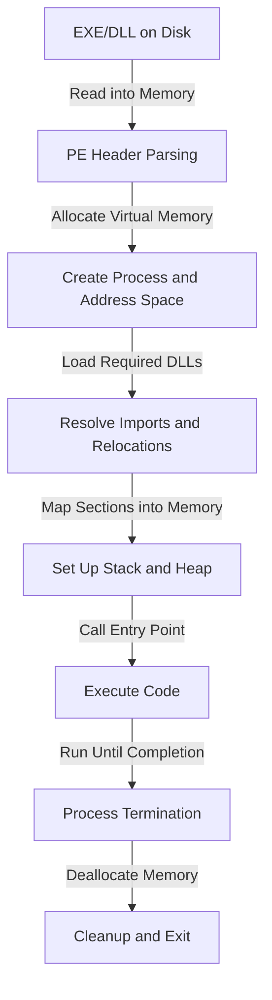
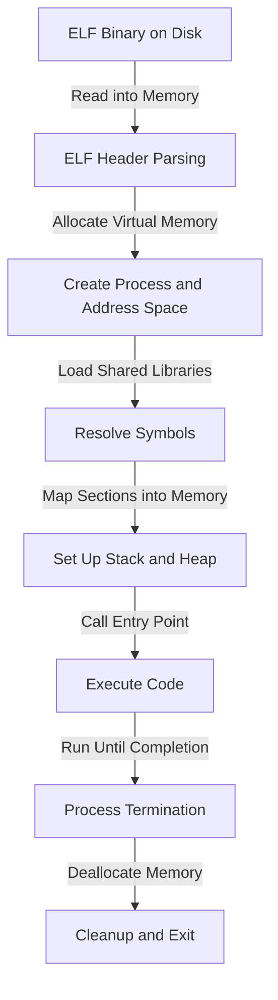

---
{"dg-publish":true,"permalink":"/attack-computer/attack-windows/1-windows-basic/6-execution/","noteIcon":"","created":"2025-04-15T14:11:19.616-04:00"}
---

# 1. Execution of EXE and DLL Files

When a windows binary (exe or dll) is executed, then what happens?

- **EXE files** start independent processes, while **DLLs** are dynamically linked dependencies.
- Both follow structured loading involving **file parsing, memory allocation, and execution**.
- Windows uses the **PE format**, Linux uses **ELF format**.
- Execution involves **dynamic linking, virtual memory allocation, and process scheduling**.

## 1.1 Overview
When an **EXE** or **DLL** file is executed, the operating system loads it into memory, prepares it for execution, and manages its lifecycle. The process involves **file access, memory allocation, dependency resolution, and execution**. Windows uses the **PE (Portable Executable)** format, while Linux uses the **ELF (Executable and Linkable Format)**.

---

## 1.2 Execution Steps

| **Step**                     | **Description**                                                                                                 |
| ---------------------------- | --------------------------------------------------------------------------------------------------------------- |
| **1. File Access**           | The OS reads the EXE/DLL file from disk into memory.                                                            |
| **2. Format Parsing**        | The OS parses the file format (PE for Windows, ELF for Linux) to locate headers, sections, and the entry point. |
| **3. Memory Allocation**     | The OS allocates virtual memory for the process, including code, data, heap, and stack sections.                |
| **4. Loading Dependencies**  | The OS loads required DLLs/shared libraries and resolves symbols.                                               |
| **5. Address Space Mapping** | The OS maps sections into the process’s virtual address space and resolves relocations.                         |
| **6. Entry Point Execution** | The OS transfers control to the entry point (`main()` or `DllMain()`).                                          |
| **7. Process Management**    | The OS manages execution, handling system calls, memory protection, and scheduling.                             |
| **8. Process Termination**   | Once execution is complete, the OS deallocates memory and cleans up resources.                                  |

---

## 1.3 Execution Flow in Windows (PE Format)

---

## 1.4 Execution Flow in Linux (ELF Format)

---

## 1.5 Key Differences: EXE vs. DLL Execution

| **Feature**          | **EXE Execution** | **DLL Execution** |
|----------------------|------------------|------------------|
| **Standalone?**      | Yes, runs as a separate process | No, must be loaded by another process |
| **Entry Point?**     | `main()` or `WinMain()` | `DllMain()` |
| **OS Handling?**     | OS creates a new process | Loaded into an existing process |
| **Shared Resources?**| Usually independent | Shares memory with the host process |
| **Execution Control?** | Runs from start to end | Can be loaded and unloaded dynamically |

---

