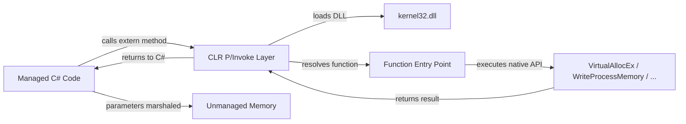

**Bottom Line Up Front:** P/Invoke lets your .NET code call native functions in DLLs, giving you access to OS‑level APIs for tasks like remote process memory allocation and execution.

P/Invoke (Platform Invocation) is a feature of the .NET runtime that bridges managed C# code with unmanaged libraries (such as `kernel32.dll`). By declaring `static extern` methods with the `[DllImport]` attribute, you can call Windows API functions directly. The CLR loads the specified DLL at runtime, resolves the function entry point, marshals parameters between managed and unmanaged memory, and returns results just like any other C# call.

This mechanism is essential for process injection techniques because it exposes the low‑level WinAPI functions—such as `VirtualAllocEx`, `WriteProcessMemory`, `VirtualProtectEx`, and `CreateRemoteThread`—that allow you to allocate memory in another process, write shellcode into it, change its permissions, and execute it stealthily.

Common pitfalls include mismatched method signatures (which can cause crashes or memory corruption), improper marshaling of complex structures or callbacks, and forgetting to immediately call `Marshal.GetLastWin32Error()` after a failing P/Invoke to retrieve the correct OS error code.