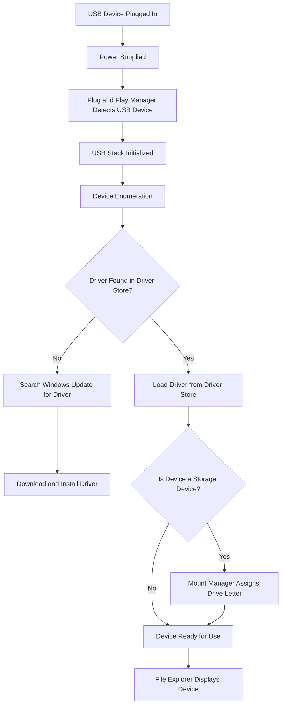

---
{"dg-publish":true,"permalink":"/attack-computer/attack-windows/1-windows-basic/usb-how-does-it-work/","noteIcon":"","created":"2025-04-15T14:11:19.617-04:00"}
---

| Component/Service           | Role                                                                 | File/Service Name            |
| --------------------------- | -------------------------------------------------------------------- | ---------------------------- |
| USB Device Plugged In       | User connects the USB device to the computer.                        | N/A                          |
| Power Supplied              | Laptop provides power to the USB device for initialization.          | N/A                          |
| Plug and Play (PnP) Manager | Detects new hardware and initiates the process to recognize the USB. | `umpnpmgr.dll`, `pnpmgr.sys` |
| USB Stack                   | Manages communication between the OS and USB device drivers.         | `usbhub.sys`, `usbstor.sys`  |
| Driver Store                | Stores pre-installed drivers for various hardware devices.           | N/A                          |
| Windows Update              | Searches online for drivers if not found locally.                    | `wuaueng.dll`                |
| Mount Manager               | Mounts storage devices, assigning a drive letter.                    | `mountmgr.sys`               |
| Device Manager              | Provides an interface for viewing and managing connected devices.    | `devmgmt.msc`                |
| File Explorer               | Allows the user to interact with the device (e.g., browsing files).  | `explorer.exe`               |
