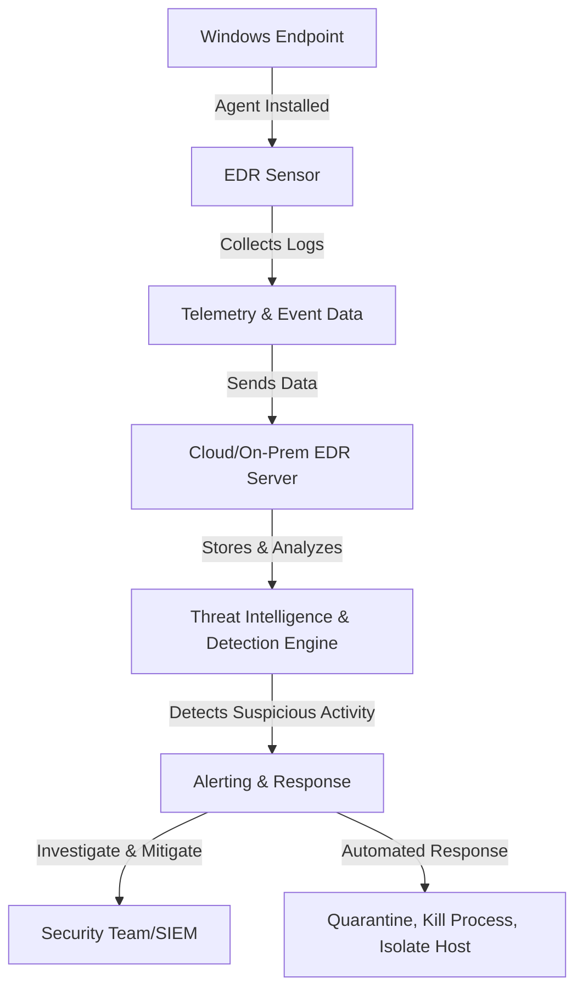
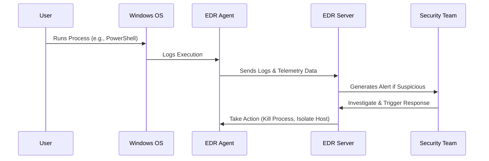
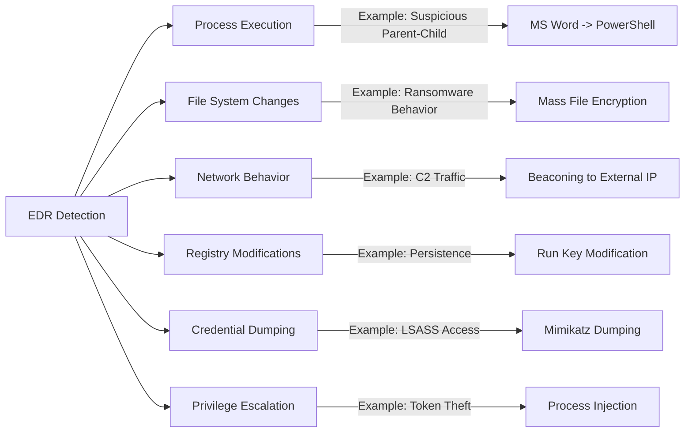
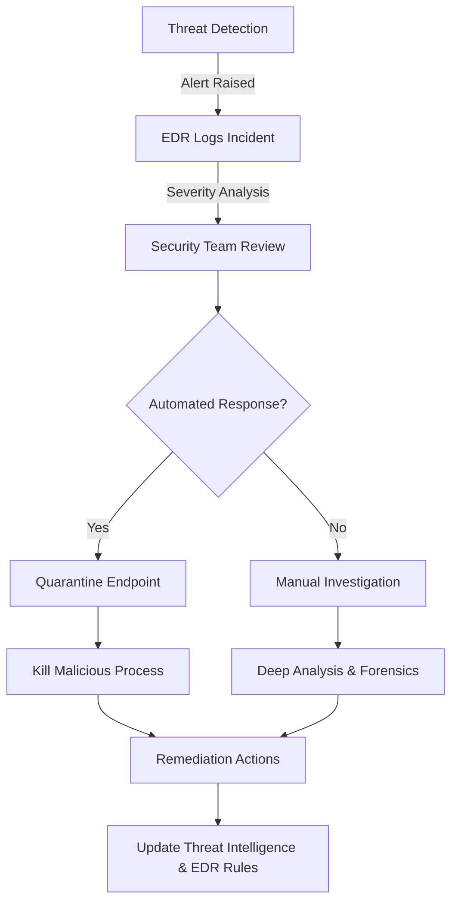
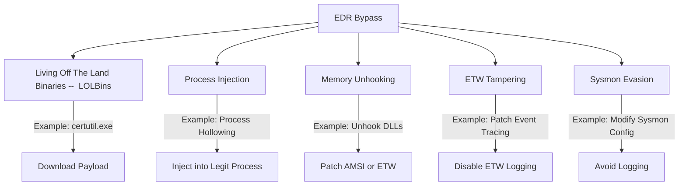

Sowhat am I dealing with? What am i trying to dodge?

# 1. EDR Architecture Overview

**Windows EDR Components and Workflow**

### **1.1 Explanation**
| Component                      | Description                                                                  |
| ------------------------------ | ---------------------------------------------------------------------------- |
| **EDR Sensor (Agent)**         | Monitors Windows events, processes, file modifications, and network traffic. |
| **Telemetry Data**             | Captures detailed system behavior for analysis.                              |
| **EDR Server**                 | Aggregates logs and applies behavior-based detection.                        |
| **Threat Intelligence Engine** | Uses **MITRE ATT&CK**, machine learning, and IoCs to flag threats.           |
| **Response Actions**           | Alerts security teams and may trigger automated responses.                   |

---

# 2. Windows EDR Monitoring Flow

**EDR Monitoring Pipeline**

### **2.1 Explanation**
- Every executed process is **logged** by the EDR agent.
- The **EDR server** checks for malicious behavior.
- If a match is found, an **alert** is generated.
- The **security team** can investigate and take actions such as **quarantining the endpoint**.

---

# 3. Common Windows EDR Detection Techniques

**EDR Detection Focus Areas**

### **3.1 Explanation**

| Detection Area             | Description                                                           |
| -------------------------- | --------------------------------------------------------------------- |
| **Process Execution**      | Tracks parent-child processes for suspicious behavior.                |
| **File System Changes**    | Identifies **ransomware**, malicious file creation, or modification.  |
| **Network Behavior**       | Detects **beaconing**, unusual DNS queries, and **C2 communication**. |
| **Registry Modifications** | Flags **persistence mechanisms** used by malware.                     |
| **Credential Dumping**     | Watches for access to `LSASS.exe` or suspicious API calls.            |
| **Privilege Escalation**   | Monitors **token theft**, **UAC bypass**, and process injections.     |

---

# 4. Windows EDR Response Workflow

**EDR Incident Response Flow**

---

# 5. Windows EDR Bypass Techniques

Mermaid Diagram: **Common EDR Evasion Techniques**

### **5.1 Explanation**
- **LOLBins**: Using trusted Windows binaries to execute malicious actions.
- **Process Injection**: Injecting payloads into **legitimate processes**.
- **Memory Unhooking**: **Removing EDR hooks** to bypass detection.
- **ETW Tampering**: **Disabling Event Tracing** to avoid logging.
- **Sysmon Evasion**: Modifying configurations to avoid telemetry logging.

| **EDR Detection Area**      | **Example Detection**                         | **Common Bypass Technique**        | **Example Evasion**                        |
|-----------------------------|----------------------------------------------|------------------------------------|--------------------------------------------|
| **Process Execution**       | Suspicious Parent-Child (MS Word → PowerShell) | **Process Injection**             | Process Hollowing, Shellcode Injection    |
| **File System Changes**     | Mass File Encryption (Ransomware)            | **Living Off The Land Binaries (LOLBins)** | Using `certutil.exe` to drop payloads   |
| **Network Behavior**        | C2 Traffic (Beaconing to External IP)        | **Memory Unhooking**              | Patching AMSI or ETW to avoid logging     |
| **Registry Modifications**  | Persistence via Run Key Modification         | **ETW Tampering**                 | Disabling ETW logging                     |
| **Credential Dumping**      | LSASS Access (Mimikatz Dumping)              | **Sysmon Evasion**                | Modifying Sysmon configuration to evade logs |
| **Privilege Escalation**    | Token Theft (Process Injection)              | **Process Injection**             | Injecting into a legitimate process       |
| **Download Prevention**     | Blocking suspicious downloads from browsers  | **User-Agent Spoofing, Encryption, Encoding** | Renaming payloads, Using HTTPS with trusted certs |

---
