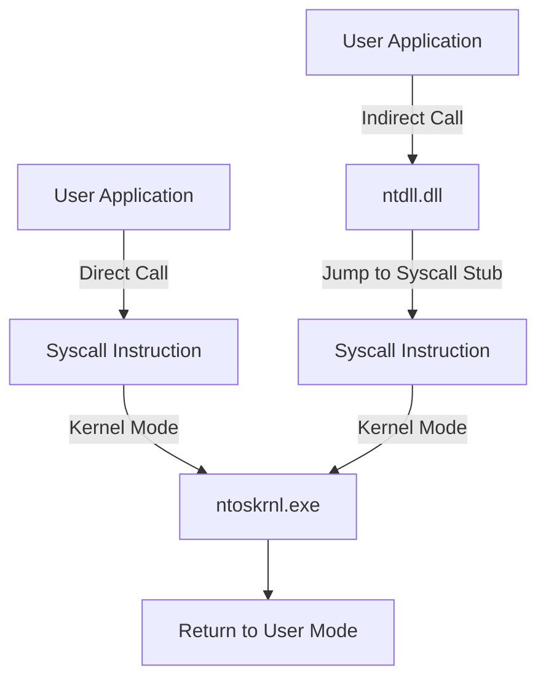

### **BLUF:**  
Direct syscalls bypass user-mode API layers by calling the syscall instruction directly. 
Direct syscalls offer stealth but leave a suspicious call stack.

---

### **Direct Syscall Workflow:**  
1. Load `ntdll.dll` and resolve the syscall number for the target function.  
2. Execute the `syscall` instruction directly without calling the user-mode API.  
3. Transfer execution to kernel mode, bypassing hooks in `ntdll.dll`.  
4. Return the result to user-mode.  

---

### **Mermaid Diagram - Direct vs Indirect Syscall**  

---

