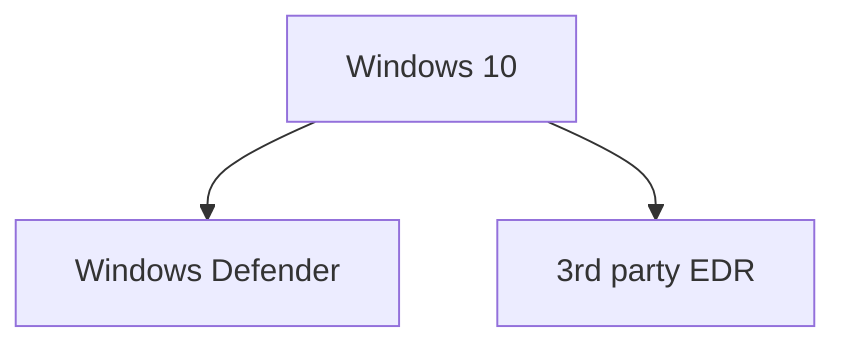

---
{"dg-publish":true,"permalink":"/attack-computer/attack-windows/1a-windows-defense-mechanism/bypass-edr/","noteIcon":"","created":"2025-04-15T14:11:19.622-04:00"}
---


I recently had a chance to get access to a windows 10 laptop system. While this was one of the unique opportunity to learn, I had some hard time bypassing Windows Defender and Symantec End Point. 




# 1. Windows Defender
https://learn.microsoft.com/en-us/archive/technet-wiki/52251.manage-windows-defender-using-powershell

Get the status of antimalware protection software

```c
Get-MpComputerStatus


```
# Windows Defender Components and Security Layers

| Layer                                 | Components                                                                                                                                                           | Purpose                                                                                                                                                                                                                       | Command to Check                                                                                                                                                                                                                                                                                                  |                                                                               |                                    |
| ------------------------------------- | -------------------------------------------------------------------------------------------------------------------------------------------------------------------- | ----------------------------------------------------------------------------------------------------------------------------------------------------------------------------------------------------------------------------- | ----------------------------------------------------------------------------------------------------------------------------------------------------------------------------------------------------------------------------------------------------------------------------------------------------------------- | ----------------------------------------------------------------------------- | ---------------------------------- |
| Hardware Layer                        | - Secure Boot<br>- Trusted Platform Module (TPM)<br>- Hardware-based Isolation<br>- **NEW:** Memory Integrity (HVCI)                                                 | Prevents unauthorized software and malware from loading during boot, provides secure cryptographic functions, isolates critical OS parts from malware, and protects the integrity of code running in the kernel.              | - Secure Boot: `Confirm-SecureBootUEFI` (PowerShell)<br>- TPM: `Get-Tpm` (PowerShell)<br>- Isolation: `systeminfo` to check Virtualization support<br>- HVCI: `Get-CimInstance -Namespace root\Microsoft\Windows\DeviceGuard -ClassName Win32_DeviceGuard`                                                        |                                                                               |                                    |
| Operating System Security             | - Windows Defender System Guard<br>- Windows Defender Application Control (WDAC)<br>- Windows Sandbox<br>- Credential Guard<br>- **NEW:** Kernel DMA Protection      | Protects OS integrity, controls executable permissions, provides a secure environment for untrusted apps, isolates credential data to prevent theft, and protects against DMA attacks.                                        | - System Guard: Check Event Viewer under System Integrity<br>- WDAC: `Get-CimInstance -ClassName Win32_DeviceGuard`<br>- Sandbox: Enabled in Windows Features<br>- Credential Guard: `Get-CimInstance -ClassName Win32_DeviceGuard`<br>- Kernel DMA Protection: `msinfo32.exe` (look for "Kernel DMA Protection") |                                                                               |                                    |
| Application Security                  | - Microsoft Defender Application Guard<br>- Exploit Protection (DEP, ASLR, CFG)<br>- Windows Defender SmartScreen<br>- **NEW:** Attack Surface Reduction (ASR) rules | Isolates risky web content, protects against memory-based attacks, blocks access to malicious files and websites, and reduces the attack surface of applications.                                                             | - Application Guard: Check Windows Features<br>- Exploit Protection: `Get-ProcessMitigation -System`<br>- SmartScreen: `reg query "HKLM\Software\Microsoft\Windows\CurrentVersion\Explorer"`<br>- ASR: `Get-MpPreference                                                                                          | Select-Object -ExpandProperty AttackSurfaceReductionRules_Ids`                |                                    |
| Identity & Access Management          | - Windows Hello<br>- Multi-Factor Authentication (MFA)<br>- Conditional Access<br>- **NEW:** Microsoft Passport                                                      | Enhances authentication through biometrics or PIN, adds an extra layer of verification, applies access policies based on location, device compliance, and risk, and provides a seamless two-factor authentication experience. | - Windows Hello: Check under Sign-in Options in Settings<br>- MFA: Managed at organizational level (no direct command)<br>- Conditional Access: Managed through Azure AD<br>- Microsoft Passport: `Get-WindowsPassportStatus` (PowerShell)                                                                        |                                                                               |                                    |
| Network Security                      | - Windows Defender Firewall<br>- Microsoft Defender for Identity<br>- Network Protection<br>- **NEW:** Web Protection                                                | Controls network traffic, monitors Active Directory for suspicious activity, blocks access to malicious domains, and provides safe browsing features.                                                                         | - Firewall: `netsh advfirewall show allprofiles`<br>- Defender for Identity: Managed in Azure AD (cloud-based)<br>- Network Protection: `Get-MpPreference                                                                                                                                                         | Select-Object EnableNetworkProtection`<br>- Web Protection: `Get-MpPreference | Select-Object EnableWebProtection` |
| Endpoint Detection & Response (EDR)   | - Microsoft Defender for Endpoint<br>- Advanced Threat Protection (ATP)<br>- **NEW:** Automated Investigation and Remediation                                        | Provides EDR capabilities, advanced threat detection, machine learning, behavior analytics, threat intelligence for proactive response, and automated threat remediation.                                                     | - Defender for Endpoint: `Get-MpComputerStatus` (PowerShell)<br>- ATP: Managed through Microsoft Defender Security Center (cloud-based)<br>- Automated Investigation: Check in Microsoft 365 Defender portal                                                                                                      |                                                                               |                                    |
| Data Protection                       | - BitLocker Encryption<br>- Windows Information Protection (WIP)<br>- File Integrity Monitoring (FIM)<br>- **NEW:** Controlled Folder Access                         | Encrypts drives, separates personal and corporate data to prevent accidental leaks, tracks changes to critical files for early breach detection, and protects against ransomware.                                             | - BitLocker: `manage-bde -status`<br>- WIP: Managed through Group Policy or Microsoft Intune<br>- FIM: `auditpol /get /subcategory:"File System"`<br>- Controlled Folder Access: `Get-MpPreference                                                                                                                | Select-Object EnableControlledFolderAccess`                                   |                                    |
| Cloud Intelligence & Threat Analytics | - Microsoft Threat Intelligence<br>- Cloud Security Posture Management (CSPM)<br>- Threat Analytics Dashboard<br>- **NEW:** Microsoft Defender Threat Intelligence   | Uses cloud-based threat intelligence, mitigates cloud misconfigurations, provides a unified threat management dashboard powered by Azure Sentinel, and offers a comprehensive view of the global threat landscape.            | - Threat Intelligence: Access via Microsoft Security Center<br>- CSPM: Managed through Microsoft Defender for Cloud<br>- Analytics Dashboard: Access in Microsoft 365 Defender portal<br>- Defender Threat Intelligence: Access through the Microsoft Defender portal                                             |                                                                               |                                    |


# 2. 3rd Party EDR
Check version
```
(Get-ItemProperty -path "HKLM:\SOFTWARE\Symantec\Symantec Endpoint Protection\CurrentVersion" PRODUCTVERSION).PRODUCTVERSION

```

| EDR Solution | Components | Purpose | Command to Check Status | Additional Features | Deployment Model |
|--------------|------------|---------|-------------------------|---------------------|-------------------|
| CrowdStrike Falcon | - Falcon Sensor (runs as `CSFalconService`)<br>- Threat Intelligence<br>- Endpoint Detection | Provides cloud-based EDR for detecting and mitigating endpoint threats. | - Service Check: `sc query CSFalconService`<br>- Logs: Check under `C:\ProgramData\CrowdStrike\Logs` | - Machine Learning<br>- Threat Hunting<br>- Automated Response | Cloud-native |
| Symantec Endpoint Protection (SEP) | - SEP Client Service (runs as `SepMasterService`)<br>- Intrusion Prevention<br>- Behavioral Analytics | Protects endpoints with antivirus, intrusion prevention, and behavioral analytics. | - Service Check: `sc query SepMasterService`<br>- SEP Console: Use `smc -status` for client status | - Device Control<br>- Application Control<br>- Network Protection | On-premises or Cloud |
| SentinelOne | - SentinelOne Agent (runs as `SentinelAgent`)<br>- ActiveEDR<br>- Rollback and Remediation | Provides autonomous EDR with threat detection, response, and rollback capabilities. | - Service Check: `sc query SentinelAgent`<br>- SentinelOne Console: Access via SentinelOne Console for detailed status | - Behavioral AI<br>- One-Click Rollback<br>- Ransomware Protection | Cloud-native |
| McAfee Endpoint Security | - ENS Threat Prevention<br>- ENS Firewall<br>- ENS Web Control | Delivers endpoint protection with antivirus, firewall, and web control features. | - Service Check: `sc query mfeepmpk` (or `sc query mfefire` for firewall)<br>- ENS Console: Open McAfee ePO console | - Real-time Scanning<br>- Exploit Prevention<br>- Adaptive Threat Protection | On-premises or Cloud |
| Carbon Black | - CB Sensor (runs as `cb` service)<br>- Threat Analysis Console<br>- Live Response | Provides threat hunting, detection, and real-time response capabilities. | - Service Check: `sc query cb`<br>- Logs: Check logs in `C:\Program Files\CarbonBlack\` | - Streaming Analytics<br>- Threat Intelligence<br>- Endpoint Isolation | Cloud-native |
| Cisco Secure Endpoint (formerly AMP) | - AMP Connector<br>- Threat Grid Integration<br>- File and Device Control | Protects endpoints with advanced malware protection and device control. | - Service Check: `sc query CiscoAMP`<br>- Connector Console: Check AMP Console for detailed insights | - Malware Protection<br>- Outbreak Control<br>- Vulnerability Assessment | Cloud-managed |
| FireEye Endpoint Security | - HX Agent<br>- Exploit Guard<br>- IOC Scanning and Containment | Delivers threat detection and response, as well as Indicator of Compromise (IOC) scanning. | - Service Check: `sc query HXAgentService`<br>- Logs: Check `C:\ProgramData\FireEye\Logs` | - Triage Analysis<br>- Enterprise Search<br>- Threat Intelligence | On-premises or Cloud |
| Kaspersky Endpoint Security | - KES Agent<br>- Behavior Detection<br>- Application Control | Provides antivirus, behavioral threat detection, and application control. | - Service Check: `sc query AVP`<br>- Logs: Located in `C:\ProgramData\Kaspersky Lab\KES` | - Network Attack Blocker<br>- Web Control<br>- Device Control | On-premises or Cloud |
| Trend Micro Apex One | - Apex One Agent<br>- Application Control<br>- Behavior Monitoring | Protects endpoints with application control, threat detection, and behavioral monitoring. | - Service Check: `sc query TmCCSF`<br>- Agent Console: Use `TmListen` to verify agent is running | - Virtual Patching<br>- Endpoint Encryption<br>- Data Loss Prevention | On-premises or Cloud |
| Sophos Intercept X | - Intercept X Endpoint Agent<br>- Exploit Mitigation<br>- Ransomware Protection | Offers EDR with exploit mitigation and advanced ransomware protection. | - Service Check: `sc query SntpService`<br>- Sophos Central Console: Check for status and alerts | - Deep Learning<br>- Root Cause Analysis<br>- Synchronized Security | Cloud-managed |
| Microsoft Defender for Endpoint | - Microsoft Defender Antivirus<br>- EDR Sensor<br>- Threat & Vulnerability Management | Provides built-in EDR for Windows with cloud-powered security analytics. | - PowerShell: `Get-MpComputerStatus`<br>- Windows Security app | - Attack Surface Reduction<br>- Automated Investigation<br>- Secure Score | Cloud-native |
| Palo Alto Networks Cortex XDR | - Cortex XDR Agent<br>- Behavioral Threat Protection<br>- Network Traffic Analysis | Delivers XDR capabilities with endpoint, network, and cloud data analysis. | - Service Check: `sc query CortexXDRAgent`<br>- Cortex XDR Console | - User Behavior Analytics<br>- Custom Playbooks<br>- Incident Management | Cloud-native |
| Cybereason | - Cybereason Sensor<br>- NGAV Engine<br>- Behavioral Analysis | Offers AI-driven EDR with automated threat hunting and response. | - Service Check: `sc query CybereasonAV`<br>- Cybereason Console | - Cross-Machine Correlation<br>- Fileless Malware Detection<br>- Guided Remediation | Cloud or On-premises |
| Bitdefender GravityZone | - GravityZone Agent<br>- HyperDetect<br>- Sandbox Analyzer | Provides risk analytics and hardening with EDR capabilities. | - Service Check: `sc query EPProtectedService`<br>- GravityZone Console | - Risk Analytics<br>- Integrated Patch Management<br>- Full Disk Encryption | Cloud or On-premises |
| Cylance PROTECT | - CylancePROTECT Agent<br>- AI-driven Threat Prevention<br>- Script Management | Utilizes AI and machine learning for predictive threat prevention. | - Service Check: `sc query CylanceSvc`<br>- Cylance Console | - Memory Exploitation Detection<br>- Device Policy Enforcement<br>- Offline Protection | Cloud-managed |

