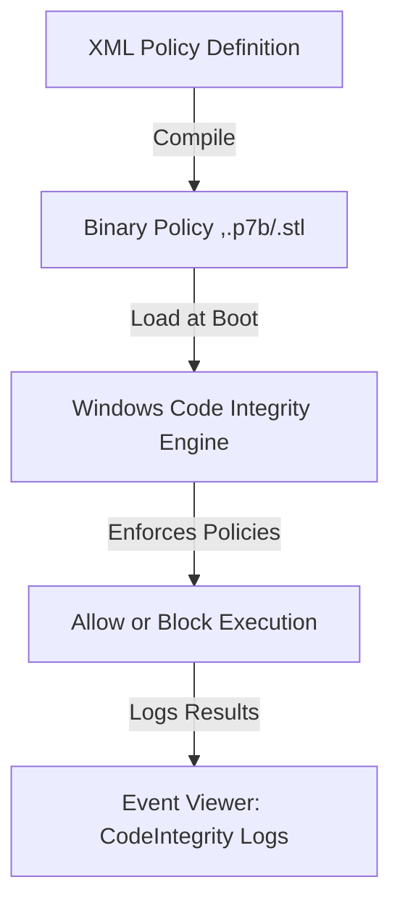

The **Windows Code Integrity Engine** (CI) is a built-in security component of Windows that enforces code integrity policies. It ensures that only trusted code—signed and approved according to system policies—can execute in both user mode and kernel mode.

---

### **Key Functions of the Windows Code Integrity Engine**

1. **Enforces Code Integrity Policies (WDAC, AppLocker, etc.)**
    - It verifies that applications, scripts, and drivers comply with **Windows Defender Application Control (WDAC)** policies.
    - It blocks unsigned or untrusted code from running if it violates security policies.
2. **Validates Digital Signatures**
    - It checks whether an application or driver is signed by a trusted certificate (e.g., Microsoft Code Signing PCA 2011).
    - If an application lacks a valid signature and is restricted by WDAC, CI blocks its execution.
3. **Monitors and Protects the Kernel**
    - In **kernel mode**, it ensures that only digitally signed drivers are loaded, preventing rootkits and unauthorized kernel modifications.
    - In **user mode**, it prevents unauthorized scripts and executables from running.
4. **Supports Virtualization-Based Security (VBS)**
    - It integrates with **Credential Guard** and **Hypervisor-Protected Code Integrity (HVCI)** to enhance security in virtualized environments.
    - VBS isolates sensitive security processes, making them tamper-resistant.
5. **Works with Other Windows Security Features**
    - **Windows Defender Application Control (WDAC)** relies on CI to enforce application control policies.
    - **Windows Defender Exploit Guard** uses CI to prevent unauthorized changes to system files.

---

### **How Windows Code Integrity Works with WDAC**

When you enable **WDAC**, the Code Integrity engine is responsible for enforcing the compiled policy. The process follows this workflow:



1. **Define Policies:** Administrators create XML-based WDAC policies specifying allowed applications and drivers.
2. **Compile to Binary:** The XML policy is compiled into a binary file (e.g., `.p7b`, `.stl`).
3. **Load During Boot:** The compiled policy is loaded into the Windows Code Integrity engine.
4. **Enforce Policies:** CI checks every executable and driver before allowing execution.
5. **Log Results:** If a process violates the policy, CI logs the event in **Event Viewer → Code Integrity logs**.

---

### **Where is the Windows Code Integrity Engine Located?**

- **Executable Component:**
    - Integrated into the Windows Kernel as part of `CI.dll` (Code Integrity DLL).
    - Can be found at:
	
```
C:\Windows\System32\ci.dll
	
```
        
- **Policy Files Stored In:**
    - Compiled policies are typically located in:
        
```
C:\Windows\System32\CodeIntegrity\
	
```
        
    - This folder contains policy files such as `SiPolicy.p7b`, which represents the active WDAC policy.

---

### **How to Check if Windows Code Integrity is Active**

You can check if Code Integrity is running using the following methods:

1. **Using PowerShell**
    
```powershell
Get-CimInstance -Namespace "root\cimv2\security\Microsoft-Windows-CodeIntegrity" -ClassName Win32_CodeIntegrityPolicy

```
    
    - If this returns data, it means Code Integrity is actively enforcing policies.
2. **Checking Event Viewer Logs**
    - Open **Event Viewer** → **Applications and Services Logs** → **Microsoft → Windows → CodeIntegrity**.
    - Look for events indicating that WDAC policies are being enforced.
3. **Checking if Kernel-Mode Code Integrity is Enabled**

```powershell
SystemInfo | Findstr /C:"Hypervisor enforced Code Integrity"

```
    
    - If enabled, it will show `"Hypervisor enforced Code Integrity: Yes"`.

---

### **Conclusion**

The **Windows Code Integrity Engine** is the core component responsible for enforcing WDAC and ensuring that only trusted applications and drivers can run. It is deeply integrated into Windows and works alongside other security mechanisms like Defender, SmartScreen, and Exploit Guard to protect the system from unauthorized or malicious code.