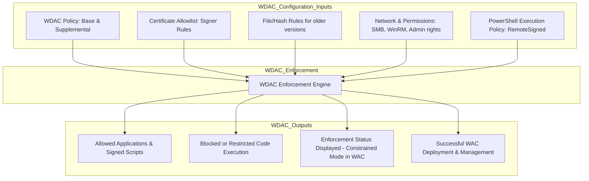
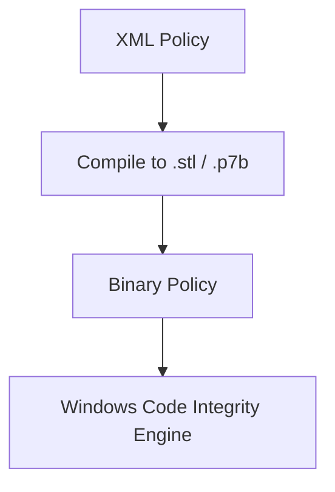
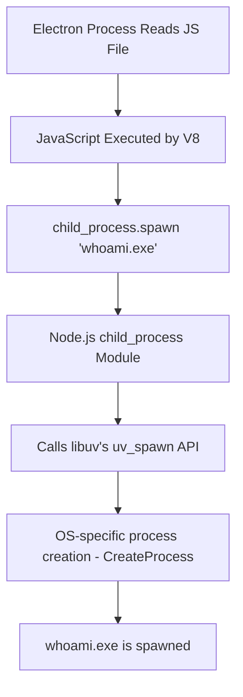
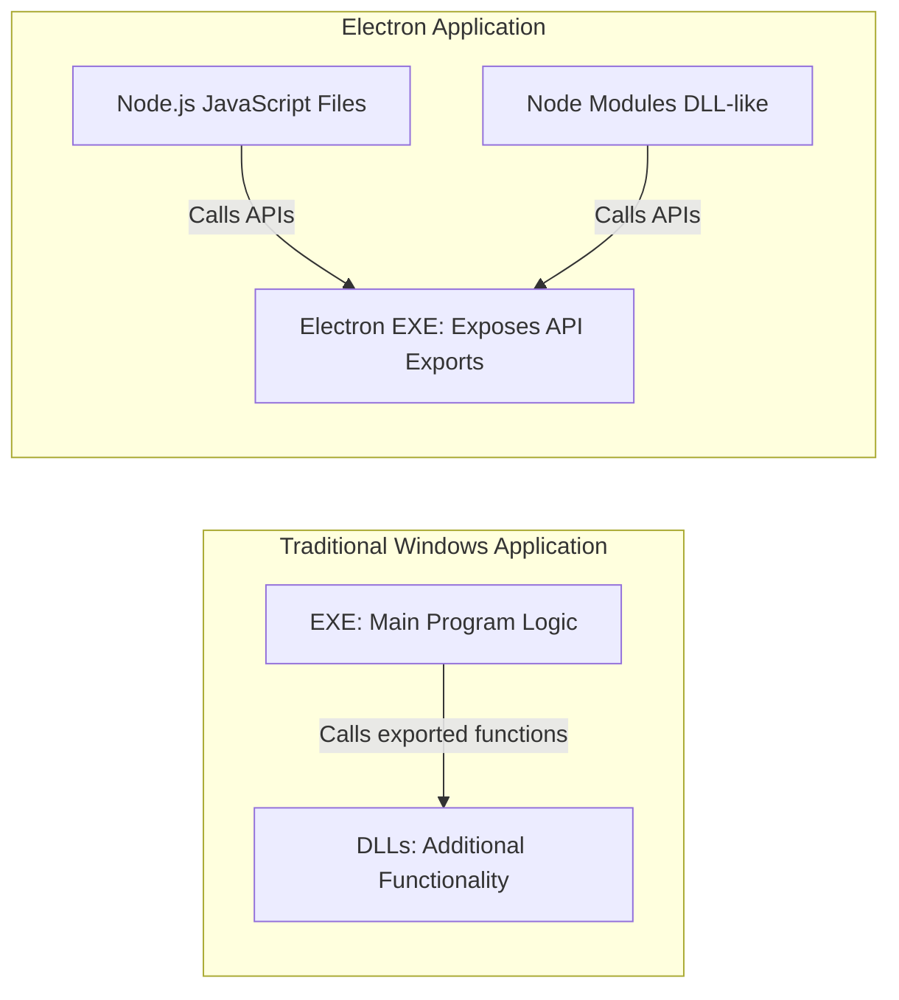

# 0. Tester here

While I was exploring ways to remain survivable during the initial drop, I came across an interesting article on LinkedIn. The author kindly asked for the opinion of a newbie, which motivated me to read and dive deeper. I have tremendous appreciation for those of you leading this field.

https://securityintelligence.com/x-force/bypassing-windows-defender-application-control-loki-c2/

I love that the author took the time to credit the researchers who deserve it. I also appreciate the depth of knowledge and effort he put into this article. Once again, please follow [Bobby Cooke](https://x.com/0xBoku) for more information.

If I have to say one negative thing about it, the website blocked Vimium, but that's a negligible issue.


---

# 1. Before Reading the Article

When I first read the article, I realized that I did not know as much as I thought. It sounded familiar, but I soon discovered there was a lot I needed to learn. Let’s dive in.

There is some foundational knowledge required to understand the article.

## 1.1 What is WDAC?

[Microsoft describes WDAC as follows: ](https://learn.microsoft.com/en-us/windows-server/manage/windows-admin-center/use/manage-application-control-infrastructure)
> Windows Defender Application Control (WDAC) can help mitigate many security threats by restricting the applications that users are allowed to run and the code that runs in the system core (kernel).

At first glance, it feels like WDAC is just another application controller. However, the article shows that WDAC does much more than simply serve as a user-facing application controller. Let’s review its inputs and outputs.



WDAC gathers many policies and loads them into an enforcement engine. Some policies allow applications to run while others block execution. Next, let’s examine the types of inputs ingested by this engine.

### 1.1.1 Examples of WDAC Inputs

| WDAC Component                                  | Example/Content                                                                                                                              | Typical Location/How to Find                                                                                                                            |
| ----------------------------------------------- | -------------------------------------------------------------------------------------------------------------------------------------------- | ------------------------------------------------------------------------------------------------------------------------------------------------------- |
| WDAC Policy: Base & Supplemental                | XML policy file defining allowed/blocked applications; for example, rules allowing Microsoft Code Signing PCA 2011                           | Stored in the Code Integrity folder (e.g., `%windir%\System32\CodeIntegrity`) or deployed via Group Policy                                              |
| Certificate Allowlist: Signer Rules             | XML rule permitting binaries signed by Microsoft Code Signing PCA 2011; for example, a rule with CertPublisher = Microsoft Corporation       | Embedded in the WDAC policy XML; viewable through policy management tools or within `%windir%\System32\CodeIntegrity`                                   |
| File/Hash Rules for older versions              | XML rules that allow specific files based on hash; for example, allowlist entries for wixca.dll or firewall.dll                              | Located inside the WDAC policy file in `%windir%\System32\CodeIntegrity`                                                                                |
| Network & Permissions: SMB, WinRM, Admin Rights | Configurations ensuring network connectivity (TCP port 445 for SMB, 5985/5986 for WinRM) and proper administrative rights for file transfers | Managed via Windows Firewall settings, Group Policy, or system network configuration tools                                                              |
| PowerShell Execution Policy: RemoteSigned       | A setting that allows signed scripts to run; ensures that the LocalMachine scope is set to RemoteSigned                                      | Checkable via PowerShell using `Get-ExecutionPolicy -List` or via registry keys at `HKLM\SOFTWARE\Microsoft\PowerShell\1\ShellIds\Microsoft.PowerShell` |

It is evident that these policies are located under `C:\Windows\System32\CodeIntegrity`. When I listed the files and directories in that folder, I did not see any XML files. Instead, I found compiled policy files and related directories:

```bash
tester@tester-surf:/mnt/c/windows/system32/CodeIntegrity$ ls -lias
total 356
 281474977639435   0 dr-xr-xr-x 1 tester tester   4096 Mar 13 09:05 .
 281474977639408   0 dr-xr-xr-x 1 tester tester   4096 Mar 13 09:12 ..
 281474977639436   0 dr-xr-xr-x 1 tester tester   4096 Apr  1  2024 CIPolicies
 281474977639440   0 dr-xr-xr-x 1 tester tester   4096 Apr  1  2024 Tokens
 281474977639443   0 dr-xr-xr-x 1 tester tester   4096 Apr  1  2024 Update
6755399441227400  68 -r-xr-xr-x 3 tester tester  68283 Jan 19 22:32 VbsSiPolicy.p7b
3377699720781077  32 -r-xr-xr-x 2 tester tester  32631 Mar 13 07:22 driver.stl
1407374883801342 224 -r-xr-xr-x 3 tester tester 228546 Feb  1 07:35 driversipolicy.p7b
3096224744070432  32 -r-xr-xr-x 2 tester tester  32631 Mar 13 07:22 previous.driver.stl
```

**Directory and File Descriptions:**

| Item                     | Description |
|--------------------------|-------------|
| CIPolicies               | Directory storing compiled Code Integrity policies that define which code (applications, drivers, etc.) is allowed to run. |
| Tokens                   | Folder containing security tokens or certificate information used to validate and enforce policies. |
| Update                   | Directory for storing updates to the Code Integrity policies so that the system can refresh or modify its policies when needed. |
| driver.stl               | Compiled policy file specifically for driver enforcement; ensures that only authorized drivers are loaded. |
| driversipolicy.p7b       | PKCS #7 file containing a signed package of driver signing policies; bundles certificates and signature data. |
| previous.driver.stl      | Backup or previous version of the driver policy file, kept for rollback or historical reference. |
| VbsSiPolicy.p7b          | PKCS #7 signed file associated with Virtualization-Based Security policies; enforces VBS and driver integrity. |

XML-formatted policies are compiled into binary files with .stl or .p7b extensions. These compiled files are ingested into the Windows Code Integrity Engine, which then enforces the policies at system reboot. Now I have a better understanding.



More details about the Windows Code Integrity Engine are available [here](https://learn.microsoft.com/en-us/windows-hardware/drivers/install/code-integrity).

A side note—how do I know if WDAC is running on my system? I can check via Event Viewer or by examining the `C:\Windows\System32\CodeIntegrity` folder. For example:

**Go to Applications and Services Logs → Microsoft → Windows → CodeIntegrity in Event Viewer.**


---

### What Does This Mean?


As mentioned in Bobby's article,[ Microsoft has published a block list](https://learn.microsoft.com/en-us/windows/security/application-security/application-control/app-control-for-business/design/applications-that-can-bypass-appcontrol). For example, from Microsoft's WDAC recommended block list:

> "Unless your use scenarios explicitly require them, Microsoft recommends that you block the following applications. An attacker can use these applications or files to circumvent application allow policies, including App Control."

It is ultimately up to an organization’s discretion to implement these recommendations. This article leads me to broader questions about layered defense mechanisms in Windows.

For now, I will mark this as a future assignment and continue with the article.  
[0. Windows defense mechanism](<../1a. Windows Defense Mechanism/0. Windows defense mechanism.md>)

---

## 1.2 Electron Applications

### 1.2.1 What is the Electron Framework?

According to the original article by Bobby:

> "As explained by Ruben Boonen in his Wild West Hackin’ Fest talk Statikk Shiv: Leveraging Electron Applications for Post-Exploitation, Electron applications function as web browsers that render desktop applications using standard web technologies like HTML, JavaScript, and CSS. The JavaScript engine in Electron is Node.js, which provides powerful APIs capable of interacting with the host operating system. These APIs allow actions such as reading and writing files, executing programs, and other operations typical of native applications."

For additional background, here is a brief definition from Wikipedia:

> **Electron** is a free and open-source software framework developed and maintained by the OpenJS Foundation. It enables the creation of desktop applications using web technologies, rendered by a version of the Chromium browser engine and powered by the Node.js runtime.

A framework is essentially an organized set of tools and libraries that help developers build applications in a specific, consistent way. An example is the Flask framework for Python.

Take Flask as an example. I can build a web application with Flask quickly. I could do the same with Python, but building a web application from scratch in Python would take much longer and likely lead to many misconfiguration issues. By following the Flask framework, I can build a web relatively quickly with fewer misconfiguration problems (I'm not saying the web would be bulletproof, just that it's easier to build it correctly).

#### 1.2.2 How Does Electron Work?

[Ksenia Peguero and Xiuzhen Cheng](https://www.sciencedirect.com/science/article/pii/S2667295221000222) produced an excellent diagram on the Electron architecture.


For a quick overview, here is a simplified explanation combined with Bobby’s description:

> "In this example, the Teams Electron process reads a JavaScript file, which then spawns whoami.exe using the child_process module. This module triggers the Electron process to execute its exported API uv_spawn, which interacts with the operating system to create a new process."

I have noted the flow below:



#### 1.2.3 Libuv and uv_spawn

[Libuv](https://github.com/libuv/libuv) is a cross-platform C library that supports asynchronous I/O and is used primarily by Node.js. The function uv_spawn is part of libuv and is used to create new processes. It wraps OS-specific APIs (such as CreateProcessW on Windows) so that the Node.js code can remain cross-platform.

Simply put, libuv is a C library, and uv_spawn is a function within that library. I found uv_spawn under libuv/src/win/process.c.  I couldn’t pinpoint a specific reason for using libuv/uv_spawn. 
I assume it helps call Windows native APIs such as CreateProcessW. I guess it's the same reason I use the requests library in Python when making an HTTP connection via the web.

```c
int uv_spawn(uv_loop_t* loop,
             uv_process_t* process,
             const uv_process_options_t* options) {
  int i;
  int err = 0;
  WCHAR* path = NULL, *alloc_path = NULL;
  BOOL result;
  WCHAR* application_path = NULL, *application = NULL, *arguments = NULL,
         *env = NULL, *cwd = NULL;
  STARTUPINFOW startup;
  PROCESS_INFORMATION info;
  DWORD process_flags, cwd_len;
  
  ...snip...
```

---

## 1.3 Difference Between Traditional Windows Applications and Electron Applications

Okay, I think I have the basic foundational knowledge to continue. Oh, wait—one more thing: What is the difference between a Windows application and an Electron application?

Fortunately, not long ago I was exploring Windows applications, so I don't need to revisit that for the sake of time. My study notes regarding traditional Windows binaries are here.

[1. Portable Executable Structure](<../1. Windows Basic/1. Portable Executable Structure.md>)
[2. From PE to Memory](<../1. Windows Basic/2. From PE to Memory.md>)
[3. Flow of System Calls - ntdll.dll, kernel32.dll](<../1. Windows Basic/3. Flow of System Calls - ntdll.dll, kernel32.dll.md>)
[4. Win32 API and Windows Native API](<../1. Windows Basic/4. Win32 API and Windows Native API.md>)
[4a. NTDLL.DLL - Overview and Functionality](<../1. Windows Basic/4a. NTDLL.DLL - Overview and Functionality.md>)
[5. Syscalls Flow](<../1. Windows Basic/5. Syscalls Flow.md>)
[5a. Syscalls Deep dive](<../1. Windows Basic/5a. Syscalls Deep dive.md>)
[5b. From Memory - PEB_TEB](<../1. Windows Basic/5b. From Memory - PEB_TEB.md>)
[6. Execution](<../1. Windows Basic/6. Execution.md>)


Bobby explains:

> "The EXE calls exported functions from DLLs to extend its capabilities. However, Electron applications reverse this architecture. Instead of the EXE calling APIs from DLLs, the Electron EXE itself exposes API exports, which are called by Node.js JavaScript files and Node modules (which function as DLLs)."

The following diagram illustrates the difference:



Initially, I had difficulty visualizing this architecture, but further research clarified that in Electron applications, the executable itself exposes the API, and the Node.js code along with Node modules leverages these APIs to interact with the operating system.

Madhav addressed the same concern concisely [here](https://github.com/alibaba/ali-dbhub/issues/342()
> Unrestricted Access to Electron APIs:
The code exposes the spawn and exec functions from the child_process module through the contextBridge to the renderer process. This allows potential unrestricted access to system-level operations and can introduce security vulnerabilities. It is recommended to carefully review and limit the exposed APIs to only those necessary for the application's functionality.
>

---
