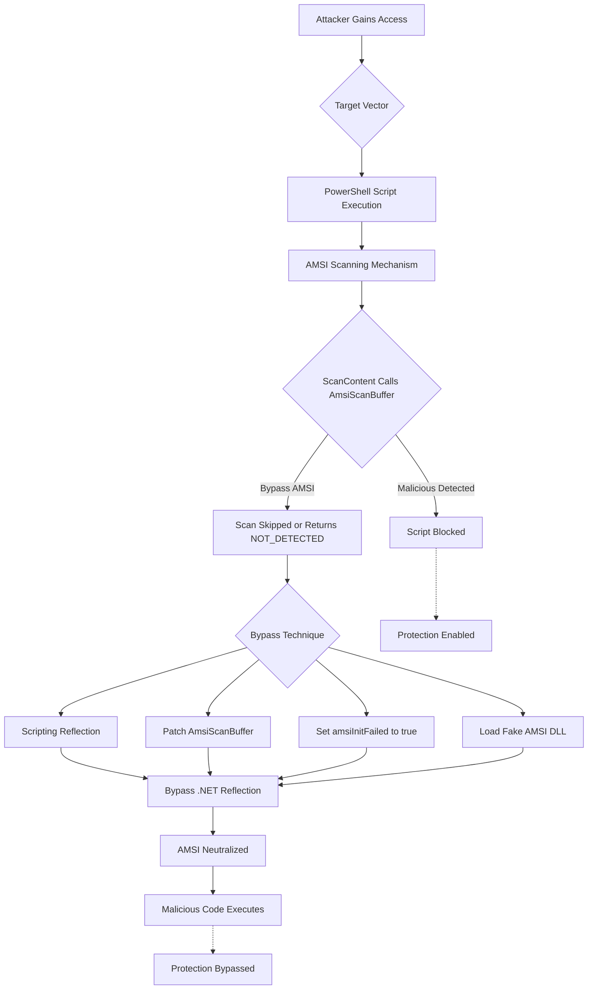

```mermaid
graph TD
    A[Attacker Gains Access] --> B{Target Vector}
    
    B --> C[PowerShell Script Execution]
    C --> D[AMSI Scanning Mechanism]
    D --> E{ScanContent Calls AmsiScanBuffer}
    
    E -->|Malicious Detected| F[Script Blocked]
    E -->|Bypass AMSI| G[Scan Skipped or Returns NOT_DETECTED]

    G --> H{Bypass Technique}
    H --> I[Scripting Reflection]
    H --> J[Patch AmsiScanBuffer]
    H --> K[Set amsiInitFailed to true]
    H --> L[Load Fake AMSI DLL]

    I --> M[Bypass .NET Reflection]
    J --> M
    K --> M
    L --> M

    M --> N[AMSI Neutralized]
    N --> O[Malicious Code Executes]

    F -.-> Z[Protection Enabled]
    O -.-> Y[Protection Bypassed]


```

