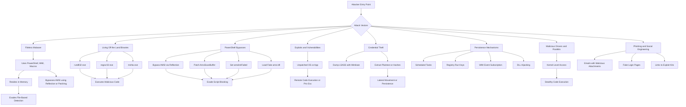

1. **Fileless Malware**: This type of malware resides in memory and doesn't write files to disk, making it harder for traditional antivirus solutions to detect. It often uses legitimate system tools like PowerShell, WMI, or macros to execute malicious code directly in memory.
    
2. **Living Off the Land Binaries (LOLBins)**: Attackers can abuse legitimate system tools and binaries that are already present on Windows, like `rundll32.exe`, `regsvr32.exe`, or `mshta.exe`, to run malicious payloads, blending in with normal operations and avoiding detection.
    
3. **Exploits and Vulnerabilities**: Attackers often exploit unpatched vulnerabilities in the operating system, drivers, or applications to gain unauthorized access or escalate privileges.
    
4. **Credential Theft**: Tools like Mimikatz can extract credentials from memory, allowing attackers to move laterally across a network or escalate their privileges.
    
5. **Persistence Mechanisms**: Attackers use various techniques to maintain persistence on a compromised system, such as registry modifications, scheduled tasks, WMI persistence, or DLL hijacking.
    
6. **Malicious Drivers and Rootkits**: By installing malicious drivers or rootkits, attackers can operate at the kernel level, making their presence harder to detect and remove.
    
7. **Phishing and Social Engineering**: Attackers frequently use phishing emails, malicious attachments, or compromised websites to trick users into running malicious code or divulging credentials.
    