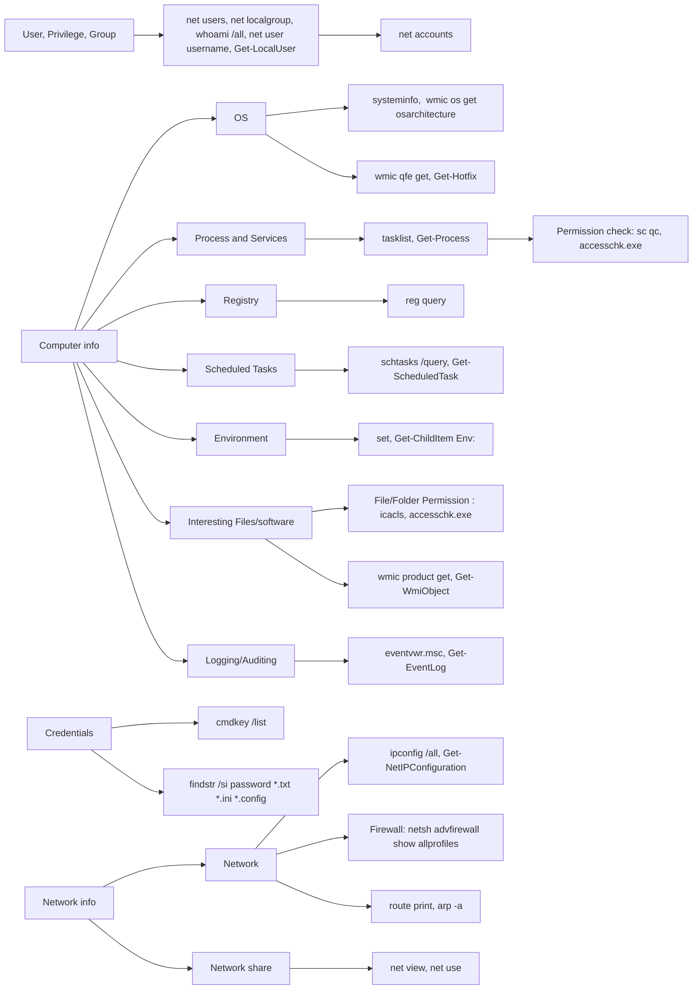

---
{"dg-publish":true,"permalink":"/attack-computer/attack-windows/enumerate-windows/","noteIcon":"","created":"2025-04-15T14:11:19.623-04:00"}
---

## Windows Enumeration Techniques

| **Category**               | **Technique**                          | **Description**                                                                          | **Tools/Commands**                                   |
| -------------------------- | -------------------------------------- | ---------------------------------------------------------------------------------------- | ---------------------------------------------------- |
| **System Information**     | Gather System Info                     | Collect basic system details such as OS version, architecture, and installed patches.    | systeminfo  wmic os get osarchitecture         |
|                            | List Installed Updates                 | Identify installed patches and updates for vulnerability assessment.                     | wmic qfe get  Get-Hotfix                       |
| **Environment Variables**  | Enumerate Environment Variables        | Check for sensitive data stored in environment variables.                                | set Get-ChildItem Env:                            |
| **User Information**       | List Users and Groups                  | Identify local users and group memberships.                                              | net users  net localgroup,   whoami /all |
|                            | Check Password Policies                | Review password policies for potential weaknesses.                                       | net accounts                                         |
| **Processes and Services** | List Running Processes                 | Identify running processes for potential insights.                                       | tasklist Get-Process                              |
|                            | Check Service Permissions              | Find services with misconfigured permissions.                                            | `sc qc`, `accesschk.exe`                             |
| **Network Configuration**  | View Network Interfaces                | Get information on network interfaces and configurations.                                | `ipconfig /all`, `Get-NetIPConfiguration`            |
|                            | List Open Ports                        | Identify open ports and listening services.                                              | `netstat -ano`                                       |
|                            | Check Firewall Rules                   | Review firewall settings and rules.                                                      | `netsh advfirewall show allprofiles`                 |
| **Scheduled Tasks**        | Enumerate Scheduled Tasks              | Identify tasks that may run with elevated privileges.                                    | `schtasks /query`, `Get-ScheduledTask`               |
| **Registry Enumeration**   | Search for Sensitive Registry Entries  | Look for registry keys that may contain credentials or configuration data.               | `reg query`                                          |
| **File System**            | Find Interesting Files and Directories | Search for files containing sensitive information like passwords or configuration files. | `dir /s *pass*`, `Get-ChildItem`                     |
|                            | Check File and Folder Permissions      | Identify files or folders with weak permissions.                                         | `icacls`, `accesschk.exe`                            |
| **Credentials**            | Check Credential Manager               | Look for saved credentials in the Windows Credential Manager.                            | `cmdkey /list`                                       |
|                            | Examine Browser Credentials            | Review saved passwords and autofill data in browsers.                                    | Use browser-specific tools                           |
| **Logging and Auditing**   | Review Event Logs                      | Analyze event logs for anomalies or important information.                               | `eventvwr.msc`, `Get-EventLog`                       |
| **Network Shares**         | Enumerate Network Shares               | Identify accessible network shares.                                                      | `net view`, `net use`                                |
| **Installed Applications** | List Installed Software                | Identify installed applications for potential vulnerabilities or management.             | `wmic product get`, `Get-WmiObject`                  |

---

## Mermaid Diagram of Windows Enumeration Techniques

---
