## 1.1 What problem does Coinbase Wallet solve?

In Web3, users must:

- Prove their **identity** without usernames or passwords.
    
- **Securely store** their private keys — the only way to control their blockchain assets.
    
- Interact directly with Decentralized Application (**dApps**), like Uniswap, OpenSea, or DeFi protocols.
    
- **Sign transactions** to interact with smart contracts.
    
- Do all of the above across **multiple blockchains**, without relying on centralized custody.
    

### 1.1.1 Without a wallet

| Challenge                    | Result                                                           |
| ---------------------------- | ---------------------------------------------------------------- |
| No way to store private keys | User cannot own or transfer crypto                               |
| No simple login method       | Users rely on centralized credentials (Web2-style)               |
| No dApp connection           | Can’t use Uniswap, mint NFTs, or stake assets                    |
| Risk of centralized hacks    | Assets are stored by third parties, violating self-custody ethos |

### 1.1.2 With Coinbase Wallet

| Solution                           | How It Helps                                     |
| ---------------------------------- | ------------------------------------------------ |
| Self-custodial private key storage | Ensures user owns their assets                   |
| Public key cryptographic login     | Secure and passwordless authentication           |
| WalletConnect + Injected Provider  | Enables dApp interoperability                    |
| Transaction signing                | Users authorize transfers, swaps, etc., securely |
| Multi-chain support                | Users interact with many networks in one place   |

### 1.1.3 Summary of Need

> Coinbase Wallet provides a **secure, user-friendly, and decentralized way** to manage crypto identities, sign transactions, and connect to the Web3 ecosystem across multiple chains — without relying on central servers or custodians.

# 2. Requirements

## 2.1 Functional Requirements

- Connect to and authenticate with dApps
    
- View and manage assets
    
- Sign and send transactions
    
- Interact with smart contracts (e.g., Uniswap, OpenSea)
    
- Support token standards (ERC-20, 721, 1155)
    

## 2.2 Security Requirements

- Private keys must never leave the device
    
- Signing operations must be explicit and user-approved
    
- Secure enclave or keystore usage on mobile
    

## 2.3 Interface Requirements

- Intuitive UI for wallet management
    
- Web3 provider injection or WalletConnect support
    
- Responsive design (mobile + desktop)
    

## 2.4 Constraints

- Must support multiple chains
    
- Must remain compatible with major dApps
    
- Performance should not degrade with large NFT/token portfolios
    

# 3. Architecture & Design

## 3.1 High-Level Diagram

## 3.2 Components

- **UI:** React web app / native mobile UI
    
- **Key Management:** LocalStorage (desktop), Secure Enclave (iOS), Android Keystore
    
- **Signing:** User approves tx; wallet signs with private key
    
- **dApp Connection:** via Injected Web3 provider or WalletConnect
    
- **Blockchain Communication:** JSON-RPC over HTTPS
    
- **Optional APIs:** Price data, token info, fiat onramps
    

# 4. Implementation

## 4.1 Technologies

|Component|Technology|
|---|---|
|Web App|React + TypeScript|
|Mobile|Native Swift/Java/Kotlin + secure keystore|
|Wallet Backend|None (self-custodial)|
|Web3 Interface|Ethers.js / WalletConnect SDK|
|IPFS (optional)|Used for NFT metadata / off-chain storage|

## 4.2 Smart Contract Interaction

- ABI defines contract functions
    
- Wallet builds tx → signs locally → sends via provider
    
- Blockchain executes and stores results immutably
    

# 5. Integration

## 5.1 Flows

|From|To|Protocol|
|---|---|---|
|dApp|Wallet|WalletConnect / window.ethereum|
|Wallet|Blockchain|Signed JSON-RPC transaction|
|dApp|Smart Contract|Function call via injected Web3 provider|
|Wallet|Coinbase API|Optional: get fiat/token price or metadata|

# 6. Verification & Validation

## 6.1 What We Test

|Test Type|Purpose|
|---|---|
|Unit test (signing)|Confirm correct cryptographic signatures|
|Integration test (dApp ↔ wallet)|Ensure compatibility across apps|
|Smart contract tx test|Validate tx encoding and result|
|Cross-chain switching|Validate behavior across networks|

# 7. Deployment & Operations

## 7.1 Channels

- **Mobile app** via App Store / Google Play
    
- **Browser extension** via Chrome Web Store
    
- **APIs** hosted by Coinbase (optional)
    

## 7.2 On-Chain Deployment

- Contracts are public
    
- Users broadcast signed tx to interact
    

# 8. Key Takeaways

## 8.1 Identity

- Your wallet address _is_ your identity
    
- Login = signature, not password
    

## 8.2 Control

- You hold the keys
    
- No Coinbase employee can access your wallet
    

## 8.3 Web3-Ready

- Plug in to DeFi, NFT, DAOs, etc.
    
- All actions require user approval
    

# 9. Authentication Flow (Explained)

## 9.1 Diagram

```mermaid
sequenceDiagram
    participant You as You
    participant Wallet as Coinbase Wallet
    participant dApp as dApp (e.g. Uniswap)
    participant SmartContract as Smart Contract on Blockchain

    You->>Wallet: Open wallet and connect to dApp
    dApp->>Wallet: Request your public address
    Wallet->>dApp: Send public address (e.g., 0xABC123)
    dApp->>Wallet: "Please sign this message to verify you"
    Wallet->>You: Ask permission to sign (no private key exposed)
    You->>Wallet: Approve signing
    Wallet->>dApp: Send signed message
    dApp->>dApp: Verify signature using public key
    dApp->>You: You're authenticated 🎉
    You->>SmartContract: Interact with the contract (e.g., swap tokens)
    SmartContract->>You: Complete transaction
```

## 9.2 Table Breakdown

|**Action**|**Detail**|
|---|---|
|**Signing a Message**|You’re proving ownership of your wallet address using your private key — without ever revealing the key.|
|**dApp Auth**|This replaces logging in with a username and password — the signed message proves your identity.|
|**Smart Contract Interaction**|Once authenticated, you can call smart contracts (e.g., swapping ETH for USDC on Uniswap) directly from the wallet.|

# 10. Security Reminders

- Private key stays **only** in the wallet (not exposed)
    
- Every action requires **explicit approval**
    
- dApps never see your private key
    
