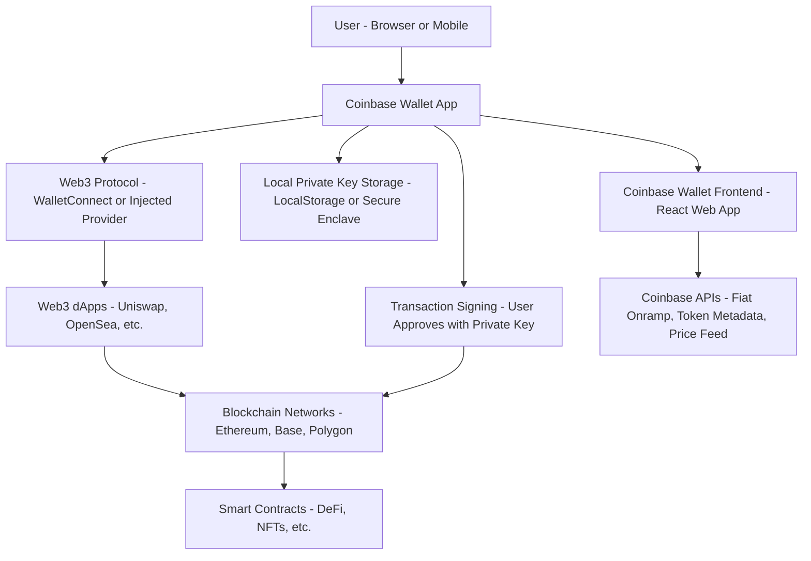

 The architecture describes a **non-custodial wallet** (Coinbase Wallet) that interacts with decentralized applications (dApps) via Web3 protocols like WalletConnect or injected providers, and signs blockchain transactions using a locally stored private key.

### **🧱 Coinbase Wallet Architecture (Simplified)**

---

| **Component**                                         | **Description**                                                                                                                                                                                                                                |
| ----------------------------------------------------- | ---------------------------------------------------------------------------------------------------------------------------------------------------------------------------------------------------------------------------------------------- |
| **User Interface (UI)**                               | The visual layer users interact with — a React-based web app or mobile frontend. Lets users view balances, send/receive assets, manage NFTs, and connect to dApps.                                                                             |
| **Coinbase Wallet App**                               | The core application (mobile or browser extension) that combines UI, key management, transaction signing, and connectivity to Web3 apps. Acts as the “hub” for wallet functions.                                                               |
| [[1b. Local Key Storage]]                             | Private keys are generated and stored **locally** on the user’s device: browser local storage (desktop) or Secure Enclave/Keystore (mobile). Coinbase has **no access** to these keys                                                          |
| [[1c. Transaction Signing]]                           | Users **sign transactions** using their private keys when interacting with dApps. The signature proves wallet ownership without revealing the private key. All critical transactions (send, swap, mint) require explicit approval.             |
| **Web3 Protocol (WalletConnect / Injected Provider)** | Connects the wallet to decentralized apps. The app either injects a provider (in browser) or uses WalletConnect (mobile) to allow users to authenticate and authorize transactions on external dApps.                                          |
| **Web3 dApps**                                        | Decentralized applications (e.g., Uniswap, OpenSea) that interact with the wallet through Web3 standards. These apps rely on smart contracts deployed to the blockchain and require wallet authentication via signed messages or transactions. |
| **Smart Contracts**                                   | Deployed logic on-chain that performs tasks like token swaps, lending, or NFT minting. The wallet sends signed transactions to these contracts on behalf of the user.                                                                          |
| **Blockchain Networks**                               | The wallet supports multiple EVM-compatible chains (Ethereum, Base, Polygon, Arbitrum, BNB Chain). Users can interact with dApps, manage assets, and view transaction history on these networks.                                               |
| **Coinbase APIs**                                     | Optional APIs used to enhance the wallet experience — includes fiat-to-crypto onramp, real-time token price data, transaction metadata, and token details. **Does not provide custody** or core wallet functionality.                          |
