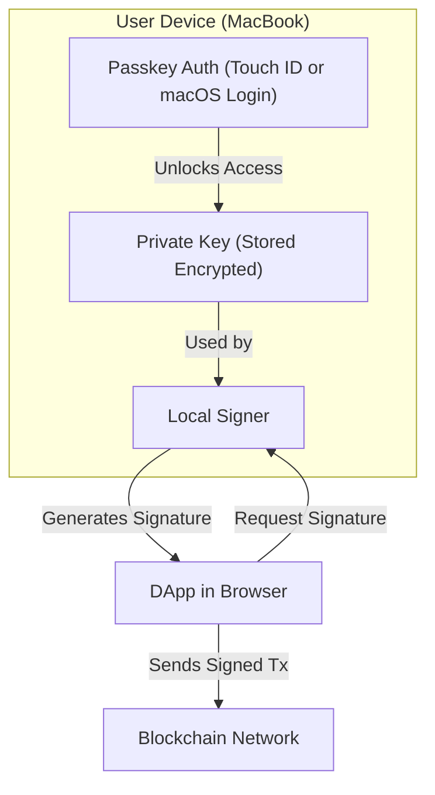
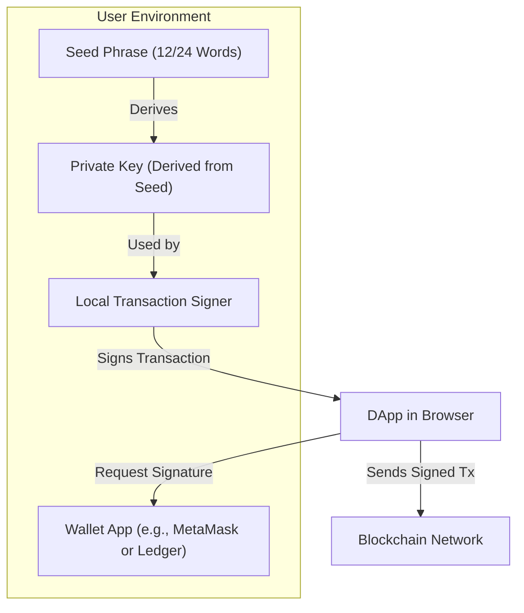
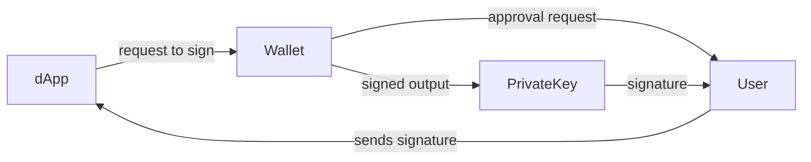

**BLUF:** A **properly designed DApp (Decentralized App)** _never_ receives your private key directly. Instead, the signing of messages or transactions happens **locally in your wallet (e.g., MetaMask, Coinbase Wallet, etc.)**, and the DApp only gets the **signed output**, not the key itself.
# With Passkey Auth




# Traditional wallet like MetaMask or a hardware wallet works with seed phrase-based private key storage:





| Feature                      | Passkey-based Cloud Wallet (e.g., Coinbase Wallet on Mac) | Seed Phrase-based Wallet (e.g., MetaMask, Ledger)       |
| ---------------------------- | --------------------------------------------------------- | ------------------------------------------------------- |
| **Private Key Location**     | Encrypted in browser or OS Keychain                       | Derived and stored locally from seed phrase             |
| **Authentication**           | Passkey (Touch ID, Face ID, macOS Login)                  | Password, PIN, or biometric (varies by wallet)          |
| **Seed Phrase Exposed?**     | No                                                        | Yes — shown during setup; must be stored safely         |
| **Signing Method**           | Handled locally using unlocked key (via Passkey)          | Handled by local signer (MetaMask) or hardware (Ledger) |
| **DApp Interaction**         | WalletConnect / Cloud session                             | Browser extension injects `window.ethereum`             |
| **Security Risk (Phishing)** | Low — keys never exposed or typed                         | Medium — phishing attacks often target seed phrases     |
| **Backup Method**            | Passkey / device-linked recovery                          | Manually store seed phrase                              |
| **Multi-device Access**      | Yes, via syncing with iCloud or device login              | Yes, but requires re-importing the seed phrase          |
| **Best For**                 | Beginners and non-custodial simplicity                    | Advanced users, hardware wallet users                   |

---
### **🛡️ How It Works Under the Hood:**
#### **1.** **Wallet Injection into Browser**

- Wallets like MetaMask or Coinbase Wallet inject a provider (like window.ethereum) into your browser.
    
- DApps interact with this provider using libraries like ethers.js or web3.js.
    
#### **2.** **DApp Requests User Action**

- The DApp asks your wallet to:
    
    - Connect your address (eth_requestAccounts)
        
    - Sign a message or transaction (eth_sign, eth_sendTransaction, etc.)
        
#### **3.** **Wallet Handles the Signing**

- Your **private key stays encrypted and stored inside the wallet extension/app**.
    
- When signing is required:
    
    - The wallet UI pops up and asks for your approval.
        
    - If approved, the **wallet signs the data using your private key locally**.
        
    - The signed data (not the private key) is sent back to the DApp.
        
    

#### **4.** **DApp Broadcasts the Signature**

- For transactions: the signed transaction is broadcast to the blockchain.
    
- For auth: signed message can prove wallet ownership (e.g., login with wallet).
    

---

### **🛠️ Example (ethers.js):**

```
const signer = provider.getSigner();
const signature = await signer.signMessage("Log me in!");
```

- The DApp calls signMessage.
    
- The wallet shows a popup.
    
- If user approves, it returns a **signature**.
    
- The **private key never leaves** the wallet. 
    


https://www.coinbase.com/wallet/articles/getting-started-extension
https://help.coinbase.com/en/wallet/browser-extension/coinbase-wallet-extension


