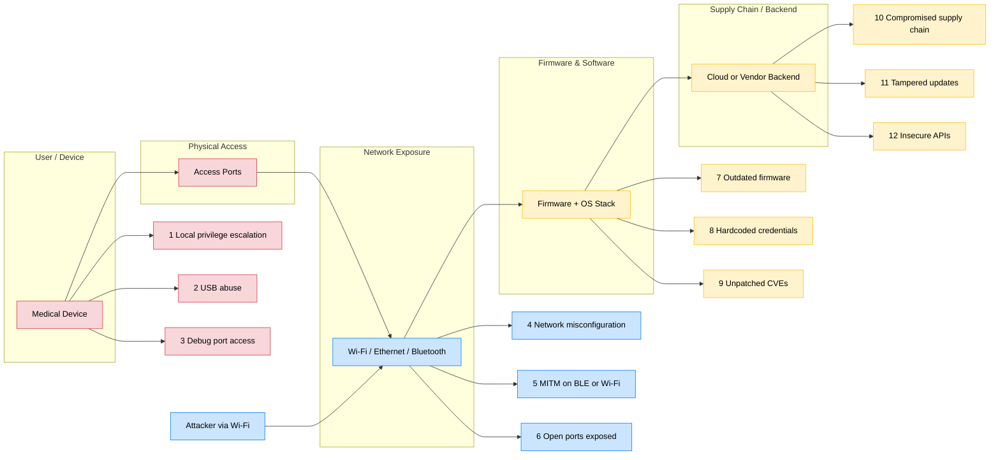

```mermaid
flowchart LR
    subgraph Phase1["User / Device"]
        A1[Medical Device]:::phys
    end

    subgraph Phase2["Physical Access"]
        B1[Access Ports]:::phys
    end

    subgraph Phase3["Network Exposure"]
        C1[Wi-Fi / Ethernet / Bluetooth]:::net
    end

    subgraph Phase4["Firmware & Software"]
        D1[Firmware + OS Stack]:::both
    end

    subgraph Phase5["Supply Chain / Backend"]
        E1[Cloud or Vendor Backend]:::both
    end

    %% Attacker Source
    R1[Attacker via Wi-Fi]:::net

    %% Main flow
    A1 --> B1 --> C1 --> D1 --> E1
    R1 --> C1

    %% Action Boxes
    NA1A["1 Local privilege escalation"]:::phys
    NA1B["2 USB abuse"]:::phys
    NA1C["3 Debug port access"]:::phys

    NB1A["4 Network misconfiguration"]:::net
    NB1B["5 MITM on BLE or Wi-Fi"]:::net
    NB1C["6 Open ports exposed"]:::net

    NC1A["7 Outdated firmware"]:::both
    NC1B["8 Hardcoded credentials"]:::both
    NC1C["9 Unpatched CVEs"]:::both

    ND1A["10 Compromised supply chain"]:::both
    ND1B["11 Tampered updates"]:::both
    ND1C["12 Insecure APIs"]:::both

    %% Correct one-to-many connections (non-sequential)
    A1 --> NA1A
    A1 --> NA1B
    A1 --> NA1C

    C1 --> NB1A
    C1 --> NB1B
    C1 --> NB1C

    D1 --> NC1A
    D1 --> NC1B
    D1 --> NC1C

    E1 --> ND1A
    E1 --> ND1B
    E1 --> ND1C

    %% Styles
    classDef phys fill:#f8d7da,stroke:#dc3545,color:#000;
    classDef net fill:#cce5ff,stroke:#007bff,color:#000;
    classDef both fill:#fff3cd,stroke:#ffc107,color:#000;

```
