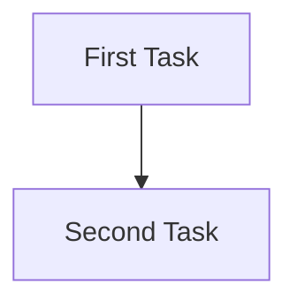
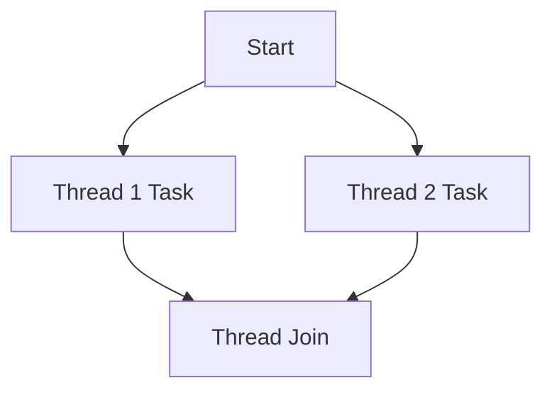
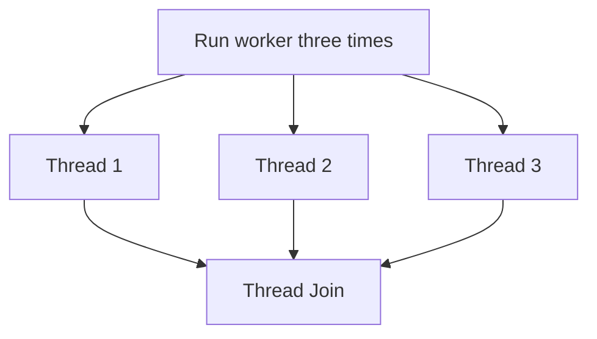

BLUF: 
- **Threading speeds up execution** by running multiple tasks in parallel.
- **Using loops** lets us manage multiple threads efficiently.
- **The trailing comma (`args=(i,)`) is required** when passing a single argument in a tuple.


# **Understanding Threading in Python**

While I was performing **SQL injection** using the **time-based technique**, I realized it took **soooo long**. I mean, I should have done the math, but I’m a lazy person. So, I just fired off a **Python script** and let it run.

The next day, I realized I might have been **doing something stupid**. As I was digging through some documentation, I learned about **threading in Python**. Being a **Python fanboy**, I decided to **dive in**.

---

## **1. Running a Simple Task Sequentially**

When I run something really simple—let’s say **sleep**, just to keep the difficulty low—the simplest example would look like this:

```python
import time

def task():
    print("Task started")
    time.sleep(2)  
    print("Task completed")

task()
task()
```

This code will run the `task` function, which does nothing more than wait **2 seconds** before responding. This will run **serially** (or **sequentially**), meaning the **first task must complete before the second one starts**.



---

## **2. Making the Code Smarter with Threading**

Now, let’s make this **useless** code a little **smarter** by adding **threading**.

```python
import threading
import time

def task():
    print(f"Task {threading.current_thread().name} started")
    time.sleep(2)  
    print("Task completed")

t1 = threading.Thread(target=task, name='Thread-1')
t2 = threading.Thread(target=task, name='Thread-2')

t1.start()
t2.start()

t1.join()
t2.join()

print("Both tasks finished")
```

This will execute in **parallel**, meaning both tasks will start at the same time instead of waiting for one another.



---

## **3. Basic Threading Syntax**

At its simplest, here’s how we can use the **threading function**:

- **Create** a thread
- **Start** a thread
- **Pass arguments** to a function

```python
import threading

def greet(name):
    print(f"Hello, {name}!")

# Create, start, and pass an argument
t = threading.Thread(target=greet, args=("Alice",))

# Start the thread
t.start()

# Wait for the thread to finish
t.join()

print("Finished")
```

However, this is **not the end goal**. We **gotta do better**.

---

## **4. Running Multiple Threads in a Loop**

Multiple threads can be executed using a **for loop** (or a `while` loop, or any loop).

To use threads multiple times, we need to do some **homework** first:

1. **Decide what function we want to run multiple times.**
2. **Determine how we want to distribute the workload.**



Here’s the **Python implementation**:

```python
import threading
import time

def worker(num):
    print(f"Thread {num} started")
    time.sleep(2)
    print(f"Thread {num} finished")

threads = []
for i in range(3):  # Create 3 threads
    t = threading.Thread(target=worker, args=(i,))
    threads.append(t)
    t.start()

# Wait for all threads to finish
for t in threads:
    t.join()

print("All threads finished execution")
```

---

## **5. Why Do I Need a Comma After `i`?**

```python
t = threading.Thread(target=worker, args=(i,))
```

In Python, **`args` must be a tuple** when passing multiple arguments to a function in `threading.Thread()`.  
However, when creating a **single-element tuple**, **you must include a trailing comma**.

### **Example of Correct and Incorrect Usage**

|**Code**|**Is it a Tuple?**|**Will It Work?**|
|---|---|---|
|`args=(i,)`|✅ **Yes**|✅ **Works Correctly**|
|`args=(i)`|❌ **No (Just an Integer)**|❌ **Throws an Error**|
|`args=(i, "Thread A")`|✅ **Yes**|✅ **Works Correctly**|

If you **omit the comma**, Python **treats `(i)` as an integer instead of a tuple**, causing an error.
